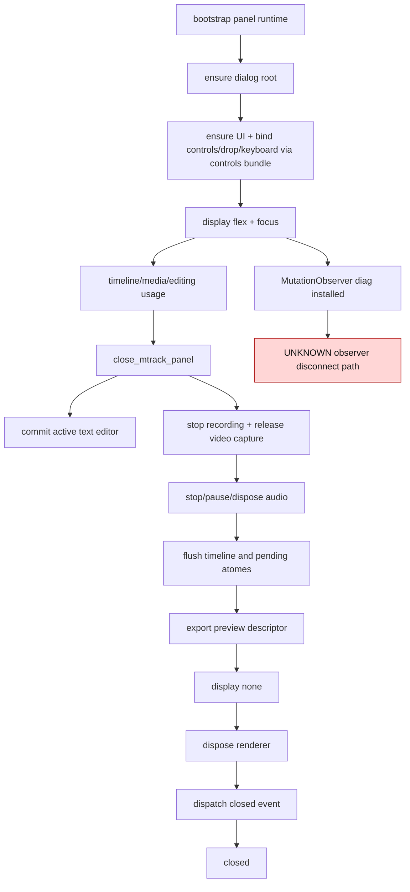

# Lifecycle Graph - panel-lifecycle

```mermaid
flowchart TD
  Create["bootstrap panel runtime"] --> EnsureRoot["ensure dialog root"]
  EnsureRoot --> BindUi["ensure UI + bind controls/drop/keyboard via controls bundle"]
  BindUi --> Open["display flex + focus"]
  Open --> Use["timeline/media/editing usage"]
  Use --> Close["close_mtrack_panel"]
  Close --> CommitText["commit active text editor"]
  Close --> StopMedia["stop recording + release video capture"]
  StopMedia --> StopAudio["stop/pause/dispose audio"]
  StopAudio --> Persist["flush timeline and pending atomes"]
  Persist --> Thumbnail["export preview descriptor"]
  Thumbnail --> Hide["display none"]
  Hide --> DisposeRenderer["dispose renderer"]
  DisposeRenderer --> Notify["dispatch closed event"]
  Notify --> Closed["closed"]

  Open --> Observer["MutationObserver diag installed"]
  Observer --> ObserverCleanupUnknown["UNKNOWN observer disconnect path"]:::risk

  classDef risk fill:#ffd6d6,stroke:#a80000,color:#111
```
