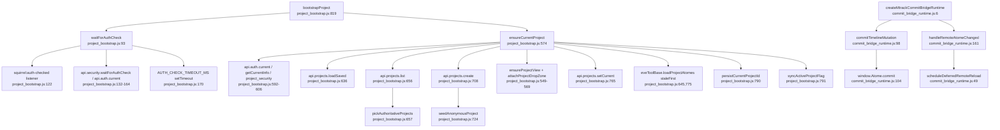

# Call Graph - project-loading

```mermaid
flowchart TD
  Boot["bootstrapProject\nproject_bootstrap.js:819"] --> Auth["waitForAuthCheck\nproject_bootstrap.js:93"]
  Auth --> Event["squirrel:auth-checked listener\nproject_bootstrap.js:122"]
  Auth --> AuthApi["api.security.waitForAuthCheck / api.auth.current\nproject_bootstrap.js:132-164"]
  Auth --> Timeout["AUTH_CHECK_TIMEOUT_MS setTimeout\nproject_bootstrap.js:170"]
  Boot --> Ensure["ensureCurrentProject\nproject_bootstrap.js:574"]
  Ensure --> CurrentUser["api.auth.current / getCurrentInfo / project_security\nproject_bootstrap.js:592-606"]
  Ensure --> Saved["api.projects.loadSaved\nproject_bootstrap.js:636"]
  Ensure --> List["api.projects.list\nproject_bootstrap.js:656"]
  List --> Pick["pickAuthoritativeProjects\nproject_bootstrap.js:657"]
  Ensure --> Create["api.projects.create\nproject_bootstrap.js:708"]
  Create --> Seed["seedAnonymousProject\nproject_bootstrap.js:724"]
  Ensure --> View["ensureProjectView + attachProjectDropZone\nproject_bootstrap.js:549-569"]
  Ensure --> SetCurrent["api.projects.setCurrent\nproject_bootstrap.js:765"]
  Ensure --> LoadAtomes["eveToolBase.loadProjectAtomes staleFirst\nproject_bootstrap.js:645,775"]
  Ensure --> PersistId["persistCurrentProjectId\nproject_bootstrap.js:790"]
  Ensure --> ActiveFlag["syncActiveProjectFlag\nproject_bootstrap.js:791"]

  CommitBridge["createMtrackCommitBridgeRuntime\ncommit_bridge_runtime.js:6"] --> Commit["commitTimelineMutation\ncommit_bridge_runtime.js:98"]
  Commit --> WindowCommit["window.Atome.commit\ncommit_bridge_runtime.js:104"]
  CommitBridge --> Remote["handleRemoteAtomeChanged\ncommit_bridge_runtime.js:161"]
  Remote --> Deferred["scheduleDeferredRemoteReload\ncommit_bridge_runtime.js:49"]
```
