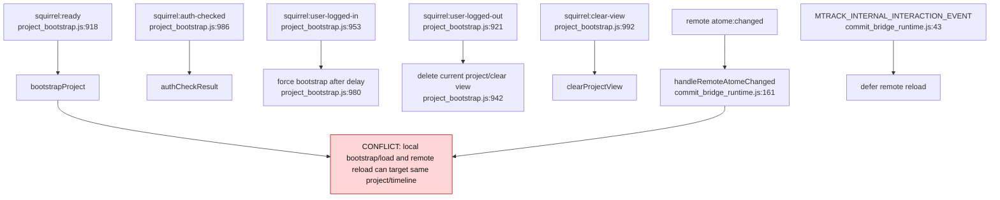

# Event Graph - project-loading

```mermaid
flowchart TD
  Ready["squirrel:ready\nproject_bootstrap.js:918"] --> Bootstrap["bootstrapProject"]
  AuthChecked["squirrel:auth-checked\nproject_bootstrap.js:986"] --> AuthState["authCheckResult"]
  LoggedIn["squirrel:user-logged-in\nproject_bootstrap.js:953"] --> Reload["force bootstrap after delay\nproject_bootstrap.js:980"]
  LoggedOut["squirrel:user-logged-out\nproject_bootstrap.js:921"] --> Clear["delete current project/clear view\nproject_bootstrap.js:942"]
  ClearView["squirrel:clear-view\nproject_bootstrap.js:992"] --> Clear2["clearProjectView"]
  AtomeChanged["remote atome:changed"] --> RemoteReload["handleRemoteAtomeChanged\ncommit_bridge_runtime.js:161"]
  Internal["MTRACK_INTERNAL_INTERACTION_EVENT\ncommit_bridge_runtime.js:43"] --> Guard["defer remote reload"]

  Conflict["CONFLICT: local bootstrap/load and remote reload can target same project/timeline"]:::risk
  Bootstrap --> Conflict
  RemoteReload --> Conflict

  classDef risk fill:#ffd6d6,stroke:#a80000,color:#111
```
