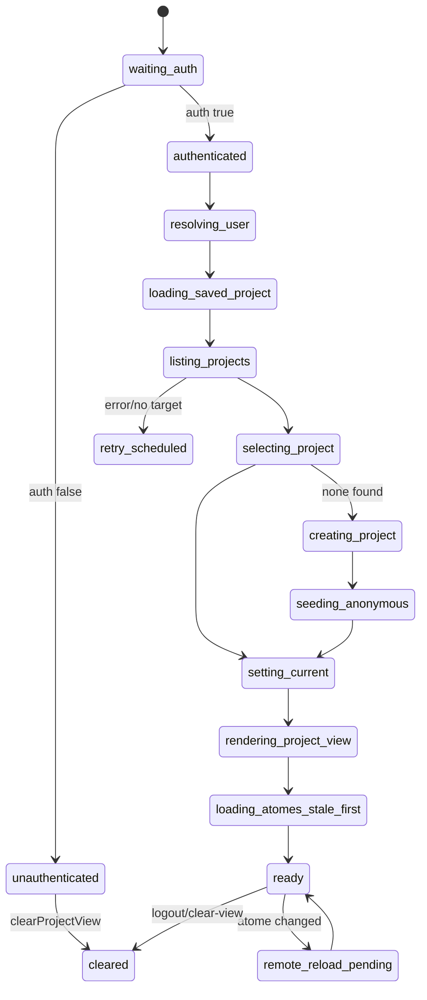

# State Graph - project-loading

```mermaid
stateDiagram-v2
  [*] --> waiting_auth
  waiting_auth --> unauthenticated: auth false
  unauthenticated --> cleared: clearProjectView
  waiting_auth --> authenticated: auth true
  authenticated --> resolving_user
  resolving_user --> loading_saved_project
  loading_saved_project --> listing_projects
  listing_projects --> selecting_project
  selecting_project --> creating_project: none found
  creating_project --> seeding_anonymous
  selecting_project --> setting_current
  seeding_anonymous --> setting_current
  setting_current --> rendering_project_view
  rendering_project_view --> loading_atomes_stale_first
  loading_atomes_stale_first --> ready
  ready --> remote_reload_pending: atome changed
  remote_reload_pending --> ready
  ready --> cleared: logout/clear-view
  listing_projects --> retry_scheduled: error/no target
```
