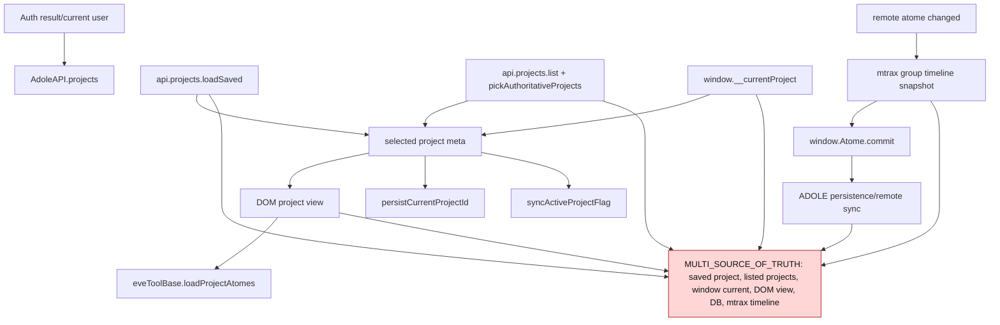

# Source-of-Truth Graph - project-loading

```mermaid
flowchart TD
  Auth["Auth result/current user"] --> ProjectApi["AdoleAPI.projects"]
  Saved["api.projects.loadSaved"] --> Selected["selected project meta"]
  List["api.projects.list + pickAuthoritativeProjects"] --> Selected
  WindowCurrent["window.__currentProject"] --> Selected
  Selected --> ProjectView["DOM project view"]
  Selected --> CurrentPersist["persistCurrentProjectId"]
  Selected --> ActiveFlag["syncActiveProjectFlag"]
  ProjectView --> Atomes["eveToolBase.loadProjectAtomes"]
  MtraxTimeline["mtrax group timeline snapshot"] --> Commit["window.Atome.commit"]
  Commit --> Database["ADOLE persistence/remote sync"]
  Remote["remote atome changed"] --> MtraxTimeline

  Multi["MULTI_SOURCE_OF_TRUTH: saved project, listed projects, window current, DOM view, DB, mtrax timeline"]:::risk
  Saved --> Multi
  List --> Multi
  WindowCurrent --> Multi
  ProjectView --> Multi
  Database --> Multi
  MtraxTimeline --> Multi

  classDef risk fill:#ffd6d6,stroke:#a80000,color:#111
```
