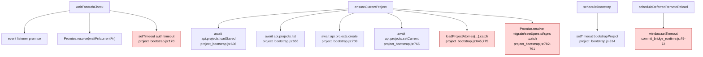

# Async Graph - project-loading

```mermaid
flowchart TD
  Auth["waitForAuthCheck"] --> EventPromise["event listener promise"]
  Auth --> ApiWait["Promise.resolve(waitFn/currentFn)"]
  Auth --> Timeout["setTimeout auth timeout\nproject_bootstrap.js:170"]:::risk
  Ensure["ensureCurrentProject"] --> LoadSaved["await api.projects.loadSaved\nproject_bootstrap.js:636"]
  Ensure --> List["await api.projects.list\nproject_bootstrap.js:656"]
  Ensure --> Create["await api.projects.create\nproject_bootstrap.js:708"]
  Ensure --> SetCurrent["await api.projects.setCurrent\nproject_bootstrap.js:765"]
  Ensure --> StaleFirst["loadProjectAtomes(...).catch\nproject_bootstrap.js:645,775"]:::risk
  Ensure --> Background["Promise.resolve migrate/seed/persist/sync .catch\nproject_bootstrap.js:782-791"]:::risk
  Retry["scheduleBootstrap"] --> RetryTimer["setTimeout bootstrapProject\nproject_bootstrap.js:814"]
  Remote["scheduleDeferredRemoteReload"] --> RemoteTimer["window.setTimeout\ncommit_bridge_runtime.js:49-72"]:::risk

  classDef risk fill:#ffd6d6,stroke:#a80000,color:#111
```
