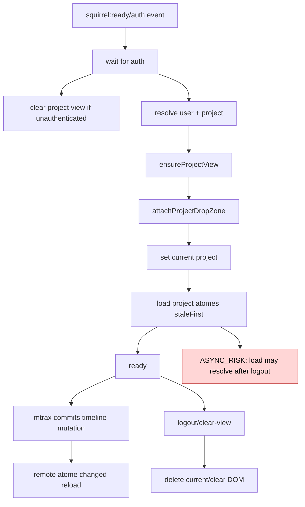

# Lifecycle Graph - project-loading

```mermaid
flowchart TD
  Start["squirrel:ready/auth event"] --> Auth["wait for auth"]
  Auth --> ClearUnauth["clear project view if unauthenticated"]
  Auth --> Resolve["resolve user + project"]
  Resolve --> EnsureView["ensureProjectView"]
  EnsureView --> Drop["attachProjectDropZone"]
  Drop --> SetCurrent["set current project"]
  SetCurrent --> LoadAtomes["load project atomes staleFirst"]
  LoadAtomes --> Ready["ready"]
  Ready --> MtraxCommit["mtrax commits timeline mutation"]
  MtraxCommit --> RemoteSync["remote atome changed reload"]
  Ready --> Logout["logout/clear-view"]
  Logout --> Cleared["delete current/clear DOM"]
  LoadAtomes --> LogoutRace["ASYNC_RISK: load may resolve after logout"]:::risk

  classDef risk fill:#ffd6d6,stroke:#a80000,color:#111
```
