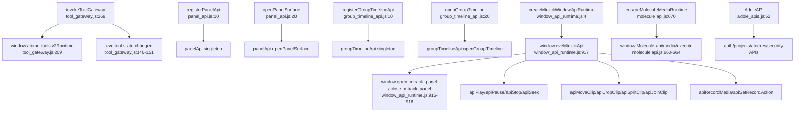

# Call Graph - runtime-api

```mermaid
flowchart TD
  ToolGateway["invokeToolGateway\ntool_gateway.js:269"] --> RuntimeV2["window.atome.tools.v2Runtime\ntool_gateway.js:209"]
  ToolGateway --> StateEvent["eve:tool-state-changed\ntool_gateway.js:146-151"]
  PanelReg["registerPanelApi\npanel_api.js:10"] --> PanelApi["panelApi singleton"]
  PanelOpen["openPanelSurface\npanel_api.js:20"] --> PanelDelegate["panelApi.openPanelSurface"]
  GroupReg["registerGroupTimelineApi\ngroup_timeline_api.js:10"] --> GroupApi["groupTimelineApi singleton"]
  GroupOpen["openGroupTimeline\ngroup_timeline_api.js:20"] --> GroupDelegate["groupTimelineApi.openGroupTimeline"]

  MtrackRuntime["createMtrackWindowApiRuntime\nwindow_api_runtime.js:4"] --> WindowMtrack["window.eveMtrackApi\nwindow_api_runtime.js:917"]
  WindowMtrack --> PanelFns["window.open_mtrack_panel / close_mtrack_panel\nwindow_api_runtime.js:915-916"]
  WindowMtrack --> Playback["apiPlay/apiPause/apiStop/apiSeek"]
  WindowMtrack --> Clips["apiMoveClip/apiCropClip/apiSplitClip/apiJoinClip"]
  WindowMtrack --> Record["apiRecordMedia/apiSetRecordAction"]

  MoleculeApi["ensureMoleculeMediaRuntime\nmolecule.api.js:670"] --> WindowMolecule["window.Molecule.api/media/execute\nmolecule.api.js:660-664"]
  Adole["AdoleAPI\nadole_apis.js:52"] --> Auth["auth/projects/atomes/security APIs"]
```
