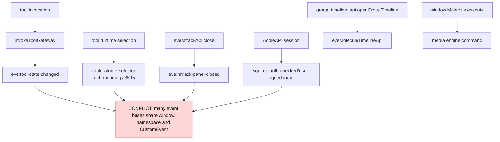

# Event Graph - runtime-api

```mermaid
flowchart TD
  ToolInvoke["tool invocation"] --> Gateway["invokeToolGateway"]
  Gateway --> ToolState["eve:tool-state-changed"]
  SelectionApi["tool runtime selection"] --> Selected["adole-atome-selected\ntool_runtime.js:3595"]
  MtrackClose["eveMtrackApi close"] --> Closed["eve:mtrack-panel-closed"]
  Auth["AdoleAPI/session"] --> AuthEvents["squirrel:auth-checked/user-logged-in/out"]
  GroupOpen["group_timeline_api.openGroupTimeline"] --> MoleculeRuntime["eveMoleculeTimelineApi"]
  WindowMolecule["window.Molecule.execute"] --> MediaCommand["media engine command"]

  Conflict["CONFLICT: many event buses share window namespace and CustomEvent"]:::risk
  ToolState --> Conflict
  Selected --> Conflict
  Closed --> Conflict
  AuthEvents --> Conflict

  classDef risk fill:#ffd6d6,stroke:#a80000,color:#111
```
