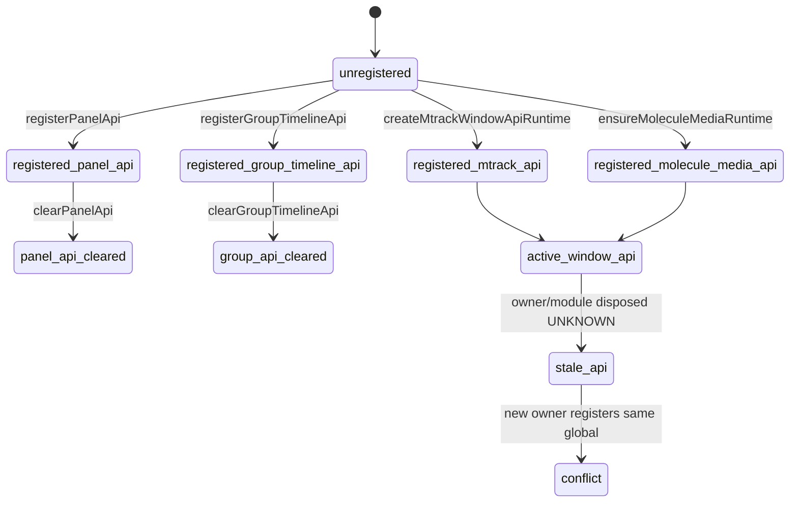

# State Graph - runtime-api

```mermaid
stateDiagram-v2
  [*] --> unregistered
  unregistered --> registered_panel_api: registerPanelApi
  unregistered --> registered_group_timeline_api: registerGroupTimelineApi
  unregistered --> registered_mtrack_api: createMtrackWindowApiRuntime
  unregistered --> registered_molecule_media_api: ensureMoleculeMediaRuntime
  registered_panel_api --> panel_api_cleared: clearPanelApi
  registered_group_timeline_api --> group_api_cleared: clearGroupTimelineApi
  registered_mtrack_api --> active_window_api
  registered_molecule_media_api --> active_window_api
  active_window_api --> stale_api: owner/module disposed UNKNOWN
  stale_api --> conflict: new owner registers same global
```
