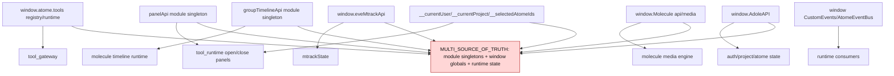

# Source-of-Truth Graph - runtime-api

```mermaid
flowchart TD
  WindowAtome["window.atome.tools registry/runtime"] --> ToolGateway["tool_gateway"]
  PanelSingleton["panelApi module singleton"] --> ToolRuntime["tool_runtime open/close panels"]
  GroupSingleton["groupTimelineApi module singleton"] --> MoleculeRuntime["molecule timeline runtime"]
  WindowMtrack["window.eveMtrackApi"] --> MtrackState["mtrackState"]
  WindowMolecule["window.Molecule api/media"] --> MediaEngine["molecule media engine"]
  AdoleAPI["window.AdoleAPI"] --> AuthProject["auth/project/atome state"]
  WindowGlobals["__currentUser/__currentProject/__selectedAtomeIds"] --> ToolRuntime
  EventBus["window CustomEvents/AtomeEventBus"] --> All["runtime consumers"]

  Multi["MULTI_SOURCE_OF_TRUTH: module singletons + window globals + runtime state"]:::risk
  WindowAtome --> Multi
  PanelSingleton --> Multi
  GroupSingleton --> Multi
  WindowMtrack --> Multi
  WindowMolecule --> Multi
  AdoleAPI --> Multi
  WindowGlobals --> Multi

  classDef risk fill:#ffd6d6,stroke:#a80000,color:#111
```
