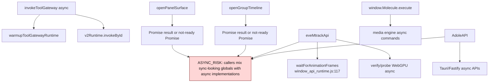

# Async Graph - runtime-api

```mermaid
flowchart TD
  Gateway["invokeToolGateway async"] --> Warmup["warmupToolGatewayRuntime"]
  Gateway --> RuntimeCall["v2Runtime.invokeById"]
  Panel["openPanelSurface"] --> PanelPromise["Promise result or not-ready Promise"]
  Group["openGroupTimeline"] --> GroupPromise["Promise result or not-ready Promise"]
  Mtrack["eveMtrackApi"] --> RafWait["waitForAnimationFrames\nwindow_api_runtime.js:117"]
  Mtrack --> RendererVerify["verify/probe WebGPU async"]
  Molecule["window.Molecule.execute"] --> MediaCommands["media engine async commands"]
  Adole["AdoleAPI"] --> Network["Tauri/Fastify async APIs"]

  Risk["ASYNC_RISK: callers mix sync-looking globals with async implementations"]:::risk
  PanelPromise --> Risk
  GroupPromise --> Risk
  Mtrack --> Risk
  Adole --> Risk

  classDef risk fill:#ffd6d6,stroke:#a80000,color:#111
```
