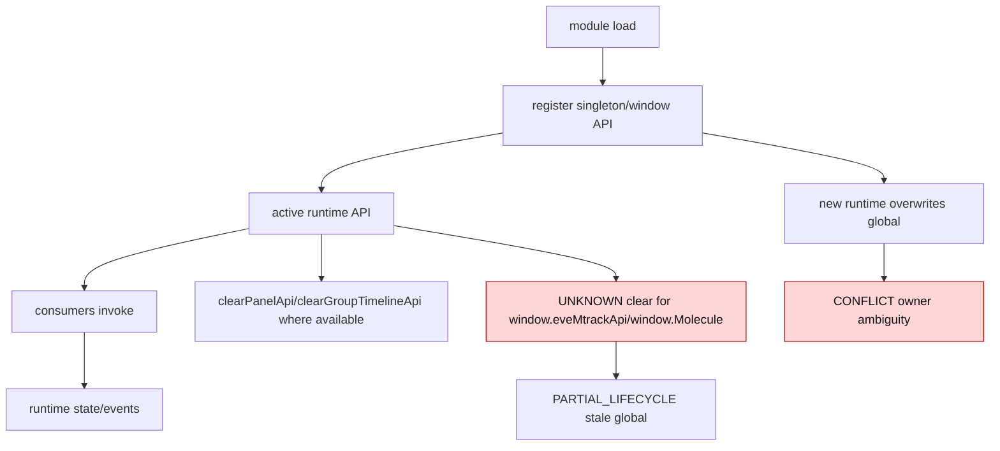

# Lifecycle Graph - runtime-api

```mermaid
flowchart TD
  ModuleLoad["module load"] --> Register["register singleton/window API"]
  Register --> Active["active runtime API"]
  Active --> Invoke["consumers invoke"]
  Invoke --> Mutate["runtime state/events"]
  Active --> Clear["clearPanelApi/clearGroupTimelineApi where available"]
  Active --> NoClear["UNKNOWN clear for window.eveMtrackApi/window.Molecule"]:::risk
  NoClear --> Stale["PARTIAL_LIFECYCLE stale global"]
  Register --> ReRegister["new runtime overwrites global"]
  ReRegister --> Conflict["CONFLICT owner ambiguity"]:::risk

  classDef risk fill:#ffd6d6,stroke:#a80000,color:#111
```
