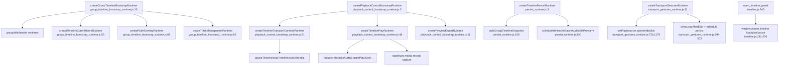

# Call Graph - sequence-timeline

```mermaid
flowchart TD
  GroupBoot["createGroupTimelineBootstrapRuntime\ngroup_timeline_bootstrap_runtime.js:10"] --> Title["group/title/header runtimes"]
  GroupBoot --> Helpers["createTimelineCoreHelpersRuntime\ngroup_timeline_bootstrap_runtime.js:55"]
  GroupBoot --> Ruler["createRulerOverlayRuntime\ngroup_timeline_bootstrap_runtime.js:66"]
  GroupBoot --> Tracks["createTrackManagementRuntime\ngroup_timeline_bootstrap_runtime.js:82"]

  PlaybackBoot["createPlaybackControlBootstrapRuntime\nplayback_control_bootstrap_runtime.js:5"] --> TransportControls["createTimelineTransportControlsRuntime\nplayback_control_bootstrap_runtime.js:21"]
  PlaybackBoot --> Play["createTimelinePlayRuntime\nplayback_control_bootstrap_runtime.js:48"]
  PlaybackBoot --> PreviewExport["createPreviewExportRuntime\nplayback_control_bootstrap_runtime.js:11"]
  Play --> AudioEngine["requestHmtracksAudioEnginePlay/Seek"]
  Play --> RecordCapture["start/sync media record capture"]
  TransportControls --> StopPause["pauseTimeline/stopTimeline/stopAllMedia"]

  Persist["createTimelinePersistRuntime\npersist_runtime.js:3"] --> Snapshot["buildGroupTimelineSnapshot\npersist_runtime.js:158"]
  Persist --> Prewarm["scheduleHmtracksNativeAudioIdlePrewarm\npersist_runtime.js:140"]
  Gestures["createTransportGesturesRuntime\ntransport_gestures_runtime.js:11"] --> Scrub["setPlayhead on pointer/dblclick\ntransport_gestures_runtime.js:730,1179"]
  Gestures --> LoopPersist["syncLoopAfterEdit -> schedule persist\ntransport_gestures_runtime.js:294-303"]

  TimelinePanel["open_timeline_panel\ntimeline.js:340"] --> TimelineApi["window.Atome.timeline load/play/pause\ntimeline.js:191-276"]
```
