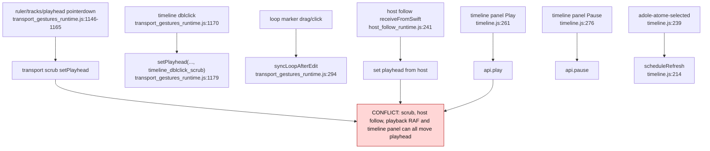

# Event Graph - sequence-timeline

```mermaid
flowchart TD
  PointerDown["ruler/tracks/playhead pointerdown\ntransport_gestures_runtime.js:1146-1165"] --> Scrub["transport scrub setPlayhead"]
  DblClick["timeline dblclick\ntransport_gestures_runtime.js:1170"] --> Seek["setPlayhead(..., timeline_dblclick_scrub)\ntransport_gestures_runtime.js:1179"]
  LoopEdit["loop marker drag/click"] --> LoopSync["syncLoopAfterEdit\ntransport_gestures_runtime.js:294"]
  HostMsg["host follow receiveFromSwift\nhost_follow_runtime.js:241"] --> HostPlayhead["set playhead from host"]
  PlayButton["timeline panel Play\ntimeline.js:261"] --> ApiPlay["api.play"]
  PauseButton["timeline panel Pause\ntimeline.js:276"] --> ApiPause["api.pause"]
  Selection["adole-atome-selected\ntimeline.js:239"] --> Refresh["scheduleRefresh\ntimeline.js:214"]

  Conflict["CONFLICT: scrub, host follow, playback RAF and timeline panel can all move playhead"]:::risk
  Scrub --> Conflict
  HostPlayhead --> Conflict
  ApiPlay --> Conflict

  classDef risk fill:#ffd6d6,stroke:#a80000,color:#111
```
