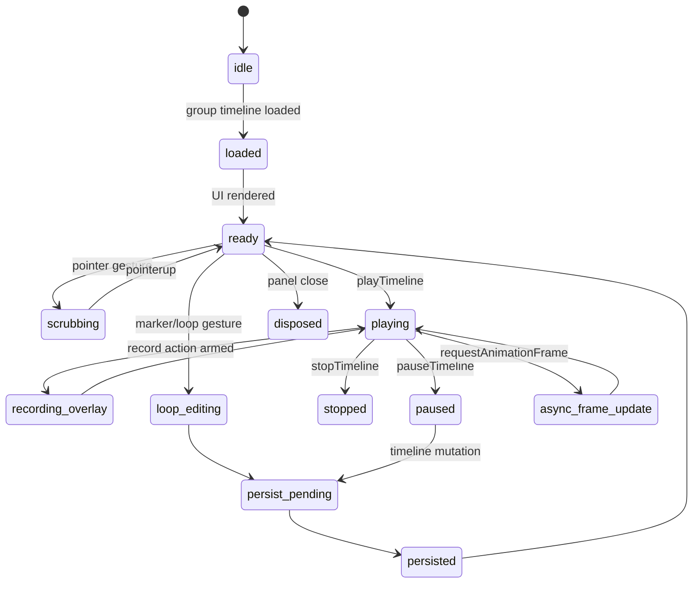

# State Graph - sequence-timeline

```mermaid
stateDiagram-v2
  [*] --> idle
  idle --> loaded: group timeline loaded
  loaded --> ready: UI rendered
  ready --> scrubbing: pointer gesture
  scrubbing --> ready: pointerup
  ready --> playing: playTimeline
  playing --> recording_overlay: record action armed
  recording_overlay --> playing
  playing --> paused: pauseTimeline
  playing --> stopped: stopTimeline
  ready --> loop_editing: marker/loop gesture
  loop_editing --> persist_pending
  paused --> persist_pending: timeline mutation
  persist_pending --> persisted
  persisted --> ready
  playing --> async_frame_update: requestAnimationFrame
  async_frame_update --> playing
  ready --> disposed: panel close
```
