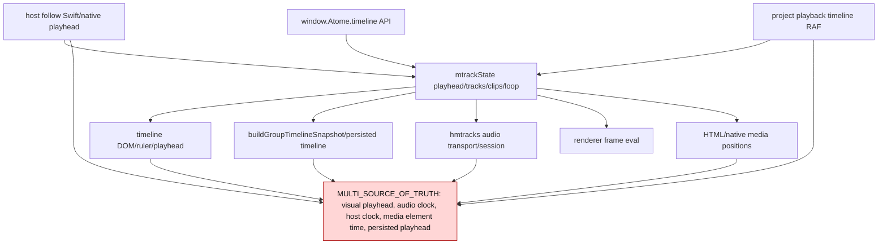

# Source-of-Truth Graph - sequence-timeline

```mermaid
flowchart TD
  State["mtrackState playhead/tracks/clips/loop"] --> UI["timeline DOM/ruler/playhead"]
  State --> Persist["buildGroupTimelineSnapshot/persisted timeline"]
  State --> Audio["hmtracks audio transport/session"]
  State --> Renderer["renderer frame eval"]
  State --> Media["HTML/native media positions"]
  Host["host follow Swift/native playhead"] --> State
  ProjectPlayback["project playback timeline RAF"] --> State
  TimelinePanel["window.Atome.timeline API"] --> State

  Multi["MULTI_SOURCE_OF_TRUTH: visual playhead, audio clock, host clock, media element time, persisted playhead"]:::risk
  UI --> Multi
  Audio --> Multi
  Media --> Multi
  Host --> Multi
  ProjectPlayback --> Multi
  Persist --> Multi

  classDef risk fill:#ffd6d6,stroke:#a80000,color:#111
```
