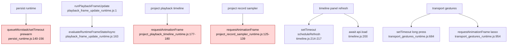

# Async Graph - sequence-timeline

```mermaid
flowchart TD
  Persist["persist runtime"] --> Prewarm["queueMicrotask/setTimeout prewarm\npersist_runtime.js:140-156"]:::risk
  PlaybackFrame["runPlaybackFrameUpdate\nplayback_frame_update_runtime.js:1"] --> EvalAsync["evaluateRuntimeFrameStateAsync\nplayback_frame_update_runtime.js:163"]
  ProjectPlayback["project playback timeline"] --> Raf["requestAnimationFrame\nproject_playback_timeline_runtime.js:177-180"]:::risk
  Sampler["project record sampler"] --> SamplerRaf["requestAnimationFrame\nproject_record_sampler_runtime.js:125-139"]:::risk
  TimelinePanel["timeline panel refresh"] --> Timer["setTimeout scheduleRefresh\ntimeline.js:214-217"]
  TimelinePanel --> Load["await api.load\ntimeline.js:200"]
  Gestures["transport gestures"] --> LongPress["setTimeout long press\ntransport_gestures_runtime.js:684"]
  Gestures --> LassoRaf["requestAnimationFrame lasso\ntransport_gestures_runtime.js:954"]

  classDef risk fill:#ffd6d6,stroke:#a80000,color:#111
```
