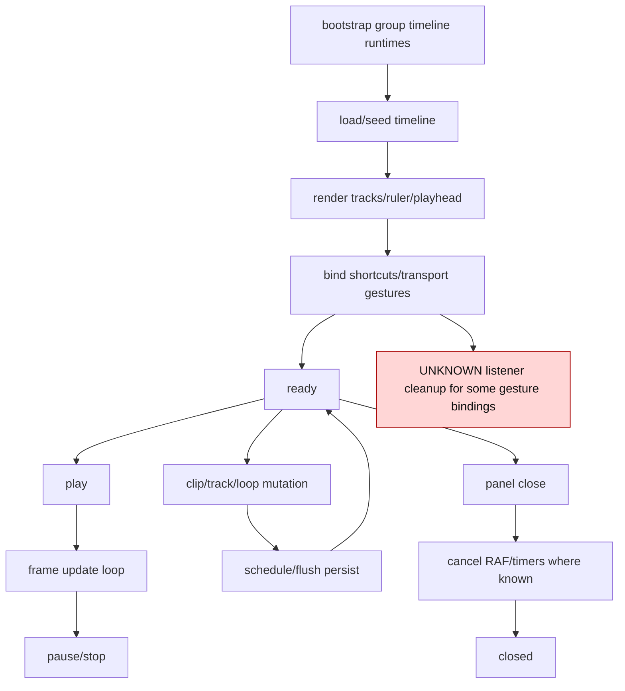

# Lifecycle Graph - sequence-timeline

```mermaid
flowchart TD
  Init["bootstrap group timeline runtimes"] --> Load["load/seed timeline"]
  Load --> Render["render tracks/ruler/playhead"]
  Render --> Bind["bind shortcuts/transport gestures"]
  Bind --> Ready["ready"]
  Ready --> Play["play"]
  Play --> FrameLoop["frame update loop"]
  FrameLoop --> Pause["pause/stop"]
  Ready --> Mutate["clip/track/loop mutation"]
  Mutate --> Persist["schedule/flush persist"]
  Persist --> Ready
  Ready --> Close["panel close"]
  Close --> Cancel["cancel RAF/timers where known"]
  Cancel --> Closed["closed"]
  Bind --> ListenerCleanupUnknown["UNKNOWN listener cleanup for some gesture bindings"]:::risk

  classDef risk fill:#ffd6d6,stroke:#a80000,color:#111
```
