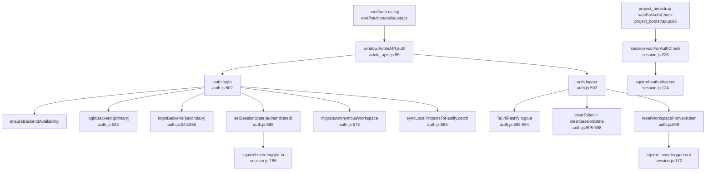

# Call Graph - user-login

```mermaid
flowchart TD
  Ui["user/auth dialog\neVe/intuition/tools/user.js"] --> API["window.AdoleAPI.auth\nadole_apis.js:55"]
  API --> Login["auth.login\nauth.js:502"]
  Login --> Availability["ensureBackendAvailability"]
  Login --> Primary["loginBackend(primary)\nauth.js:523"]
  Login --> Secondary["loginBackend(secondary)\nauth.js:544,555"]
  Login --> SetSession["setSessionState(authenticated)\nauth.js:568"]
  SetSession --> Events["squirrel:user-logged-in\nsession.js:185"]
  Login --> Migrate["migrateAnonymousWorkspace\nauth.js:573"]
  Login --> Sync["syncLocalProjectsToFastify.catch\nauth.js:585"]

  API --> Logout["auth.logout\nauth.js:592"]
  Logout --> BackendLogout["Tauri/Fastify logout\nauth.js:593-594"]
  Logout --> ClearTokens["clearToken + clearSessionState\nauth.js:595-598"]
  Logout --> Reset["resetWorkspaceForNextUser\nauth.js:599"]
  Reset --> LoggedOut["squirrel:user-logged-out\nsession.js:170"]

  ProjectBoot["project_bootstrap waitForAuthCheck\nproject_bootstrap.js:93"] --> SessionWait["session waitForAuthCheck\nsession.js:236"]
  SessionWait --> AuthChecked["squirrel:auth-checked\nsession.js:124"]
```
