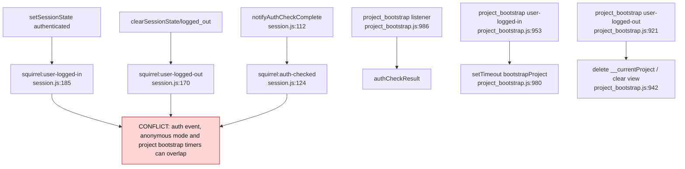

# Event Graph - user-login

```mermaid
flowchart TD
  LoginSuccess["setSessionState authenticated"] --> LoggedIn["squirrel:user-logged-in\nsession.js:185"]
  Logout["clearSessionState/logged_out"] --> LoggedOut["squirrel:user-logged-out\nsession.js:170"]
  AuthComplete["notifyAuthCheckComplete\nsession.js:112"] --> AuthChecked["squirrel:auth-checked\nsession.js:124"]
  ProjectAuth["project_bootstrap listener\nproject_bootstrap.js:986"] --> BootstrapAuthState["authCheckResult"]
  ProjectLogin["project_bootstrap user-logged-in\nproject_bootstrap.js:953"] --> ForceBootstrap["setTimeout bootstrapProject\nproject_bootstrap.js:980"]
  ProjectLogout["project_bootstrap user-logged-out\nproject_bootstrap.js:921"] --> ClearProject["delete __currentProject / clear view\nproject_bootstrap.js:942"]

  Conflict["CONFLICT: auth event, anonymous mode and project bootstrap timers can overlap"]:::risk
  LoggedIn --> Conflict
  LoggedOut --> Conflict
  AuthChecked --> Conflict

  classDef risk fill:#ffd6d6,stroke:#a80000,color:#111
```
