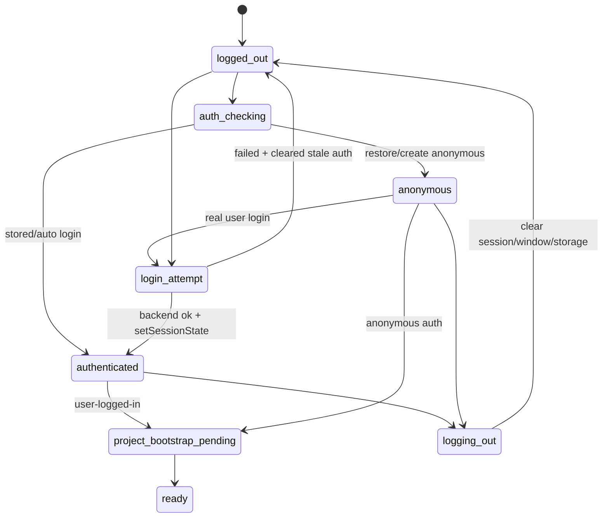

# State Graph - user-login

```mermaid
stateDiagram-v2
  [*] --> logged_out
  logged_out --> auth_checking
  auth_checking --> anonymous: restore/create anonymous
  auth_checking --> authenticated: stored/auto login
  anonymous --> login_attempt: real user login
  logged_out --> login_attempt
  login_attempt --> authenticated: backend ok + setSessionState
  login_attempt --> logged_out: failed + cleared stale auth
  authenticated --> project_bootstrap_pending: user-logged-in
  anonymous --> project_bootstrap_pending: anonymous auth
  project_bootstrap_pending --> ready
  authenticated --> logging_out
  anonymous --> logging_out
  logging_out --> logged_out: clear session/window/storage
```
