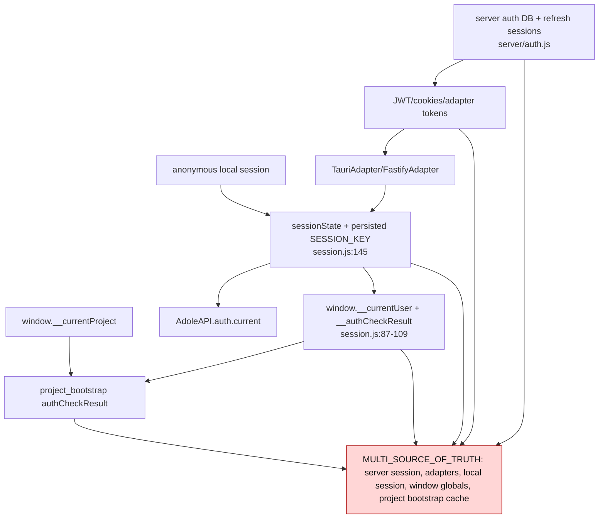

# Source-of-Truth Graph - user-login

```mermaid
flowchart TD
  Server["server auth DB + refresh sessions\nserver/auth.js"] --> Tokens["JWT/cookies/adapter tokens"]
  Tokens --> Adapters["TauriAdapter/FastifyAdapter"]
  Adapters --> Session["sessionState + persisted SESSION_KEY\nsession.js:145"]
  Session --> Window["window.__currentUser + __authCheckResult\nsession.js:87-109"]
  Window --> ProjectBoot["project_bootstrap authCheckResult"]
  Session --> AdoleAPI["AdoleAPI.auth.current"]
  Anonymous["anonymous local session"] --> Session
  ProjectCurrent["window.__currentProject"] --> ProjectBoot

  Multi["MULTI_SOURCE_OF_TRUTH: server session, adapters, local session, window globals, project bootstrap cache"]:::risk
  Server --> Multi
  Tokens --> Multi
  Session --> Multi
  Window --> Multi
  ProjectBoot --> Multi

  classDef risk fill:#ffd6d6,stroke:#a80000,color:#111
```
