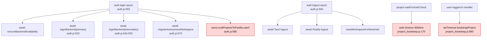

# Async Graph - user-login

```mermaid
flowchart TD
  Login["auth.login async\nauth.js:502"] --> Availability["await ensureBackendAvailability"]
  Login --> Primary["await loginBackend(primary)\nauth.js:523"]
  Login --> Secondary["await loginBackend(secondary)\nauth.js:544,555"]
  Login --> Migrate["await migrateAnonymousWorkspace\nauth.js:573"]
  Login --> Sync["syncLocalProjectsToFastify.catch\nauth.js:585"]:::risk
  Logout["auth.logout async\nauth.js:592"] --> Tauri["await Tauri logout"]
  Logout --> Fastify["await Fastify logout"]
  Logout --> Reset["resetWorkspaceForNextUser"]
  ProjectWait["project waitForAuthCheck"] --> Timeout["auth timeout 4000ms\nproject_bootstrap.js:170"]:::risk
  ProjectLogin["user-logged-in handler"] --> Timer["setTimeout bootstrapProject\nproject_bootstrap.js:980"]:::risk

  classDef risk fill:#ffd6d6,stroke:#a80000,color:#111
```
