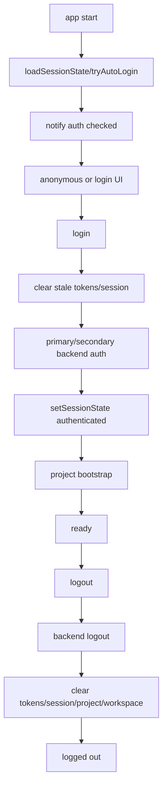

# Lifecycle Graph - user-login

```mermaid
flowchart TD
  Start["app start"] --> Restore["loadSessionState/tryAutoLogin"]
  Restore --> AuthCheck["notify auth checked"]
  AuthCheck --> AnonymousOrLogin["anonymous or login UI"]
  AnonymousOrLogin --> Login["login"]
  Login --> ClearStale["clear stale tokens/session"]
  ClearStale --> Backend["primary/secondary backend auth"]
  Backend --> Session["setSessionState authenticated"]
  Session --> Project["project bootstrap"]
  Project --> Ready["ready"]
  Ready --> Logout["logout"]
  Logout --> BackendLogout["backend logout"]
  BackendLogout --> Clear["clear tokens/session/project/workspace"]
  Clear --> LoggedOut["logged out"]
```
