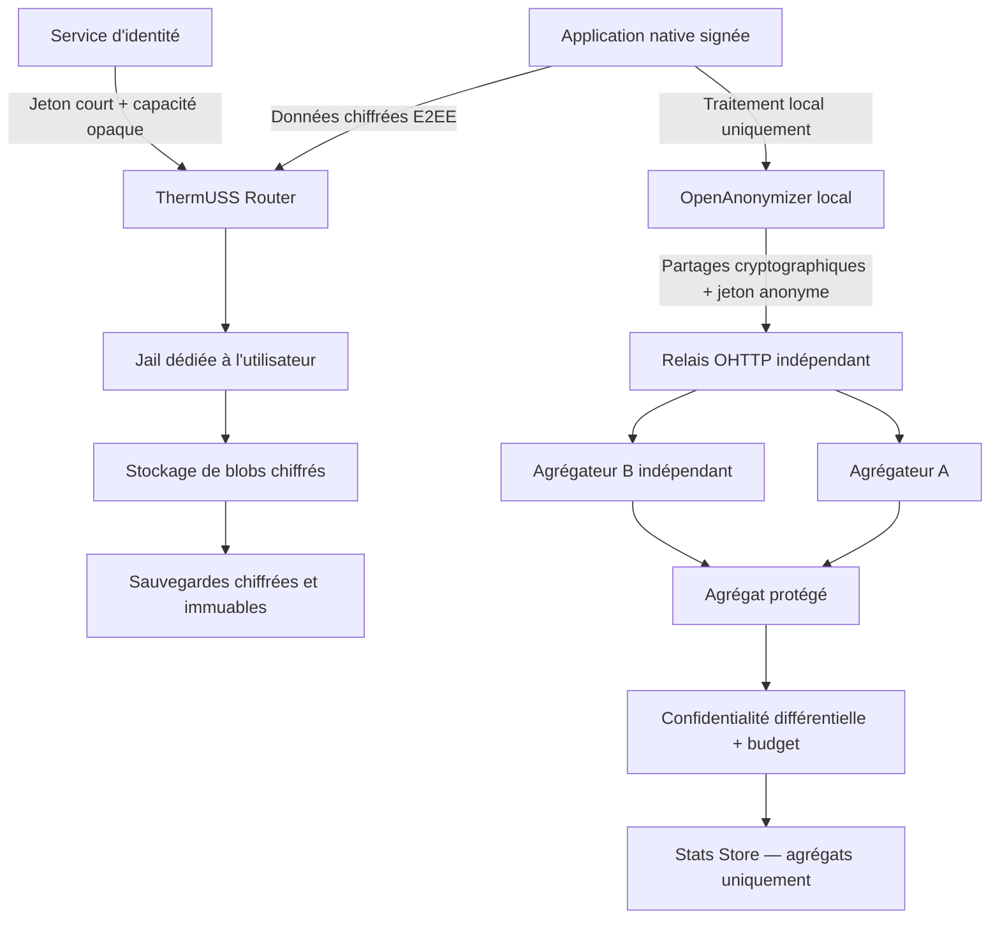

# ThermUSS — Architecture de sécurité renforcée, protection des données et conformité

**Version :** 2.0  
**Date :** 23 juin 2026  
**Statut :** architecture cible — mise en production interdite tant que les critères de validation du § 28 ne sont pas satisfaits  
**Périmètre :** application utilisateur, chiffrement de bout en bout, Router, Jails dédiées, stockage, sauvegardes, anonymisation locale, chaîne statistique et exploitation scientifique

> Cette spécification vise un niveau de sécurité très élevé. Elle ne prétend pas rendre le système invulnérable. Les garanties supposent un terminal utilisateur non compromis, des primitives cryptographiques correctement implémentées et l’absence de collusion entre les opérateurs indépendants de la chaîne statistique.

---

## 1. Décision d’architecture

Les choix suivants sont obligatoires :

1. **Les Jails par utilisateur sont conservées** comme couche d’isolation et de limitation d’impact.
2. **Les Jails ne reçoivent jamais de clé de déchiffrement ni de donnée en clair.** Elles ne constituent pas la source principale de confidentialité.
3. **Le chiffrement et le déchiffrement ont lieu uniquement sur un appareil utilisateur autorisé.**
4. **OpenAnonymizer s’exécute uniquement sur l’appareil utilisateur.** Son exécution dans une Jail est interdite.
5. **Tout code client pouvant accéder aux données en clair ou aux clés est auditable, signé et construit de manière vérifiable.**
6. **La chaîne statistique utilise au minimum deux agrégateurs indépendants**, un canal réseau dissociant l’adresse IP du contenu, des jetons anonymes à usage unique et une publication sous confidentialité différentielle.
7. **Aucun administrateur ThermUSS, hébergeur ou chercheur ne dispose d’une clé permettant de déchiffrer les données personnelles.**
8. **La récupération de compte ne permet jamais au serveur de récupérer les données sans un secret détenu par l’utilisateur.**

---

## 2. Vocabulaire normatif

- **DOIT / NE DOIT PAS** : exigence obligatoire.
- **DEVRAIT / NE DEVRAIT PAS** : exigence recommandée, dont toute exception doit être documentée et approuvée.
- **PEUT** : option autorisée.
- **Donnée brute** : toute donnée saisie ou dérivée pouvant concerner un utilisateur avant agrégation protectrice.
- **Donnée personnelle chiffrée** : donnée personnelle rendue illisible au serveur par chiffrement de bout en bout ; elle reste une donnée personnelle au sens réglementaire.
- **Agrégat publiable** : résultat statistique ayant passé les seuils, contrôles de requêtes et mécanismes de confidentialité différentielle.
- **Zero-access** : le service héberge les données mais ne détient pas les clés permettant de lire leur contenu.

Le terme **zero-access** est préféré à une affirmation absolue de « zero-knowledge », car le service traite nécessairement certaines métadonnées techniques et d’authentification.

---

## 3. Objectifs de sécurité

ThermUSS DOIT assurer :

- la confidentialité des données de santé contre le serveur, l’hébergeur et les administrateurs ;
- l’intégrité et l’authenticité des données chiffrées ;
- l’isolation forte entre utilisateurs ;
- la révocation des accès futurs d’un appareil compromis ;
- la détection des retours à une ancienne version des clés ou des données ;
- la minimisation des métadonnées ;
- l’impossibilité pour un seul acteur de relier une contribution statistique à son auteur et d’en lire la valeur individuelle ;
- la limitation mesurable du risque d’inférence à partir des résultats statistiques ;
- la traçabilité des actions administratives sans journaliser le contenu médical ;
- la restauration après incident sans accès au texte clair ;
- la démontrabilité des garanties par des preuves d’audit.

ThermUSS NE garantit PAS :

- la confidentialité sur un téléphone ou ordinateur déjà compromis au moment du déchiffrement ;
- l’effacement d’une copie déjà exportée ou photographiée par l’utilisateur ;
- l’effacement rétroactif chez un appareil révoqué ayant déjà copié d’anciennes clés et données ;
- la disponibilité face à un administrateur disposant du contrôle total de l’infrastructure ;
- l’anonymat si le relais réseau, tous les agrégateurs et le collecteur statistique colludent ;
- l’anonymat d’un résultat mal conçu ou publié hors des règles de cette spécification.

---

## 4. Architecture globale



### 4.1 Séparation des plans

ThermUSS sépare physiquement et logiquement :

- le **plan d’identité** ;
- le **plan de stockage personnel** ;
- le **plan statistique** ;
- le **plan d’administration** ;
- les environnements de développement, test, préproduction et production.

Le plan statistique NE DOIT PAS recevoir l’identifiant de compte, l’identifiant de Jail, le jeton de session personnel, l’adresse électronique ou tout identifiant stable du plan d’identité.

---

## 5. Classification des données

| Niveau | Exemples | Traitement autorisé |
|---|---|---|
| **S0 — secrets cryptographiques utilisateur** | clés racines, clés d’époque, clés de données, secret de récupération | appareil autorisé uniquement ; jamais en clair côté serveur |
| **S1 — données personnelles de santé** | formulaires, résultats, notes, texte libre, historique | chiffrement local avant transmission ; déchiffrement local uniquement |
| **S2 — métadonnées personnelles** | compte, appareils, adresse IP, heure précise, relation compte/Jail | minimisation, séparation, pseudonymisation, durée limitée |
| **S3 — contributions statistiques protégées** | partages VDAF, jetons anonymes utilisés | traitement éphémère par agrégateurs ; jamais comme dossier individuel |
| **S4 — agrégats publiables** | histogrammes, moyennes, tendances avec bruit et seuils | accès chercheurs selon gouvernance et journal de budget |
| **S5 — données publiques** | documentation, code source publié, schémas | publication autorisée après revue |

Une donnée chiffrée n’est pas automatiquement anonyme. Les niveaux S1 et S2 restent soumis au RGPD tant qu’ils peuvent être rattachés à une personne par des moyens raisonnables.

---

## 6. Modèle de menace

### 6.1 Adversaires couverts

- attaquant Internet externe ;
- utilisateur tentant d’accéder à la Jail d’un autre utilisateur ;
- administrateur système curieux ou malveillant ;
- compromission d’une base de données ou d’une sauvegarde ;
- compromission du Router ;
- compromission d’un seul agrégateur statistique ;
- vol d’un appareil verrouillé ;
- vol de jetons de session ;
- attaque par rejeu ;
- attaque de chaîne d’approvisionnement logicielle ;
- tentative de publication de cohortes trop fines ;
- attaque par différence entre plusieurs résultats statistiques ;
- faux comptes et contributions multiples ;
- retour forcé vers une ancienne liste d’appareils ou une ancienne clé.

### 6.2 Hypothèses indispensables

- le système d’exploitation et l’environnement sécurisé du terminal remplissent correctement leur rôle ;
- au moins un des deux agrégateurs statistiques ne collabore pas avec l’autre ;
- le relais OHTTP et la passerelle statistique ne colludent pas ;
- les algorithmes et bibliothèques retenus sont audités et utilisés conformément à leur documentation ;
- les utilisateurs protègent leur secret de récupération.

---

## 7. Client de confiance et chaîne de publication

### 7.1 Type de client

Le traitement de données sensibles DOIT être réalisé par une **application native mobile ou de bureau signée**.

Une application web servie dynamiquement par le même opérateur NE DOIT PAS être utilisée comme client principal de chiffrement, car un serveur compromis pourrait modifier le JavaScript avant le chiffrement. Une interface web peut être proposée uniquement si :

- elle ne reçoit aucune donnée sensible en clair ; ou
- elle s’appuie sur un composant local signé et indépendant qui effectue réellement le chiffrement et affiche clairement la version vérifiée.

### 7.2 Code auditable

Doivent être publics ou accessibles sans restriction aux auditeurs :

- la collecte des données avant chiffrement ;
- le chiffrement, le déchiffrement et la gestion des clés ;
- le registre d’appareils ;
- OpenAnonymizer ;
- la génération des contributions statistiques ;
- le code de mise à jour et de vérification des signatures ;
- le Router, la couche de gestion des Jails et les agrégateurs.

Tout module propriétaire pouvant lire une donnée S0 ou S1 est interdit. Les composants propriétaires éventuels doivent être isolés techniquement et ne recevoir que des données déjà rendues non sensibles.

### 7.3 Publication sécurisée

Chaque version DOIT :

- être construite dans une chaîne CI isolée et éphémère ;
- produire un SBOM signé ;
- utiliser des dépendances verrouillées par version et empreinte ;
- produire une provenance de build vérifiable ;
- être signée par une clé de publication protégée matériellement ;
- nécessiter l’approbation de deux personnes distinctes ;
- publier ses empreintes dans un journal de transparence append-only ;
- être reproductible ou, à défaut, faire l’objet d’une comparaison binaire indépendante documentée ;
- ne charger aucun code exécutable distant après installation.

Les clés de signature de production ne doivent pas être accessibles directement aux développeurs ou au serveur CI.

### 7.4 SDK et télémétrie

Sont interdits dans le processus manipulant S0/S1 :

- publicité ;
- analytics tiers ;
- enregistreurs de session ;
- claviers ou WebViews non maîtrisés ;
- crash dumps contenant mémoire, formulaires, clés ou jetons ;
- modèles d’IA distants recevant du texte utilisateur.

La télémétrie technique facultative DOIT être désactivée par défaut, explicitement consentie et dépourvue de contenu médical.

---

## 8. Profil cryptographique

### 8.1 Règles générales

- Aucun algorithme cryptographique propriétaire ou « fait maison ».
- Utilisation exclusive de bibliothèques largement auditées et maintenues.
- Tous les formats cryptographiques sont versionnés.
- Toute évolution d’algorithme fait l’objet d’un plan de migration et d’une revue indépendante.
- Tous les échecs d’authentification AEAD provoquent un rejet fermé, sans retour partiel de données.

### 8.2 Primitives cibles

| Usage | Profil cible |
|---|---|
| chiffrement des objets | AES-256-GCM avec une nouvelle clé aléatoire par objet et par version |
| enveloppement des clés de données | AES-256-KWP, RFC 5649, sous une clé d’enveloppement dérivée de l’EK |
| encapsulation vers un appareil ou la clé publique de récupération | HPKE, RFC 9180, profil P-256 + HKDF-SHA-256 + AES-256-GCM |
| dérivation | HKDF-SHA-256 avec séparation stricte des domaines |
| signatures de manifeste | ECDSA P-256/SHA-256, clé matérielle lorsque disponible |
| hachage | SHA-256 ou SHA-384 selon le profil de signature |
| aléatoire | CSPRNG du système d’exploitation uniquement |
| transport | TLS 1.3 minimum |

Un profil X25519/ChaCha20-Poly1305 peut être retenu à la place du profil P-256/AES-GCM si l’audit d’implémentation démontre une meilleure compatibilité. Un même type d’objet ne doit pas combiner arbitrairement plusieurs profils.

### 8.3 Hiérarchie des clés

Chaque utilisateur possède :

1. **une paire de chiffrement par appareil — DK-ENC**, non exportable lorsque le matériel le permet ;
2. **une paire de signature par appareil — DK-SIG**, distincte de DK-ENC et de la clé d’authentification ;
3. **une paire de récupération — RK**, dont la clé publique est enregistrée et dont la clé privée reste chiffrée ;
4. **une clé d’époque — EK**, aléatoire sur 256 bits et renouvelée après tout changement sensible de la liste d’appareils ;
5. **une clé de données — DEK**, aléatoire sur 256 bits pour chaque objet et chaque nouvelle version ;
6. **un secret de récupération — RS**, aléatoire sur 256 bits, détenu uniquement par l’utilisateur.

Fonctionnement :

- chaque DEK est enveloppée sous une clé d’enveloppement dérivée de l’EK active ;
- chaque EK est encapsulée séparément vers la clé DK-ENC de chaque appareil actif ;
- chaque EK est aussi encapsulée vers la clé publique de récupération RK ;
- la clé privée RK est chiffrée par AES-256-GCM sous une clé dérivée de RS avec HKDF-SHA-256, un sel aléatoire et une séparation de domaine explicite ;
- après récupération, la clé privée RK est effacée de la mémoire dès que les EK nécessaires ont été ré-enveloppées vers le nouvel appareil ;
- une récupération réussie déclenche la proposition de rotation de RK, obligatoire en cas de suspicion de compromission.

Le serveur peut stocker uniquement :

- les clés publiques DK-ENC, DK-SIG et RK ;
- les DEK enveloppées sous une EK ;
- les EK encapsulées pour chaque appareil actif et pour RK ;
- la clé privée RK uniquement sous forme chiffrée par une clé dérivée de RS ;
- les manifestes signés ;
- les ciphertexts.

Aucune clé privée ni clé symétrique utilisable ne doit être transmise en clair au serveur.

### 8.4 Format d’un objet chiffré

Chaque objet utilise un nonce GCM de 96 bits généré par CSPRNG. La DEK étant renouvelée à chaque version, aucune paire `(DEK, nonce)` ne doit être réutilisée. Pour un objet découpé en blocs, chaque bloc possède une sous-clé ou un compteur de nonce unique vérifié par le client.

Chaque objet contient au minimum :

```text
format_version
algorithm_suite_id
random_object_id
object_version
key_epoch
nonce
ciphertext
authentication_tag
wrapped_DEK
hash_of_non_sensitive_AAD
client_signature
```

Les données associées authentifiées comprennent le type d’objet, sa version, l’époque de clé et l’identifiant aléatoire. Elles NE DOIVENT PAS contenir de nom, adresse électronique, diagnostic ou autre donnée directement lisible.

### 8.5 Réduction des fuites de métadonnées

- Identifiants d’objets aléatoires d’au moins 128 bits.
- Tailles arrondies à des classes prédéfinies ; padding pour les objets sensibles.
- Heures exactes conservées dans le contenu chiffré ; métadonnées serveur arrondies lorsque possible.
- Aucune nomenclature de fichier révélatrice.
- Index de recherche construit localement et chiffré.
- Regroupement des transmissions lorsque la latence fonctionnelle le permet.

---

## 9. Gestion multi-appareils, récupération et révocation

### 9.1 Ajout d’un appareil

L’authentification au compte ne suffit pas pour donner accès aux données.

Un nouvel appareil doit être autorisé par l’une des méthodes suivantes :

- validation cryptographique par un appareil déjà autorisé via QR code ou canal authentifié ;
- utilisation locale du secret de récupération RS.

Le serveur ne peut pas autoriser seul un nouvel appareil à déchiffrer.

L’appareil existant :

1. vérifie la présence de l’utilisateur ;
2. vérifie les clés publiques DK-ENC et DK-SIG du nouvel appareil ;
3. signe l’ajout dans le registre d’appareils ;
4. encapsule l’EK active vers DK-ENC ;
5. ré-encapsule progressivement les anciennes EK nécessaires à l’accès historique ;
6. publie un nouveau registre versionné et signé.

Tous les appareils existants reçoivent une alerte d’ajout.

### 9.2 Secret de récupération

RS est généré localement. Une paire de récupération RK est générée en même temps ; sa clé privée est chiffrée sous une clé dérivée de RS. RS est présenté sous deux formes :

- QR code exportable hors ligne ;
- représentation textuelle à forte entropie avec somme de contrôle.

RS :

- n’est jamais envoyé au serveur ;
- n’est jamais inclus dans la télémétrie ou une sauvegarde cloud automatique de l’application ;
- doit être confirmé par l’utilisateur lors de la création ;
- permet de déchiffrer la clé privée RK, qui déverrouille ensuite les EK encapsulées pour la récupération ;
- ne permet pas de s’authentifier sans contrôle complémentaire.

Perdre tous les appareils et RS implique la perte irréversible des données. Cette conséquence doit être affichée sans ambiguïté.

### 9.3 Révocation

Lorsqu’un appareil est révoqué :

- ses sessions et jetons sont invalidés immédiatement ;
- sa clé publique est marquée révoquée dans un registre signé ;
- une nouvelle EK est générée pour toutes les nouvelles écritures ;
- les objets à haute sensibilité sont re-chiffrés immédiatement avec de nouvelles DEK ;
- les autres objets peuvent être migrés progressivement selon une politique documentée ;
- les autres appareils vérifient la nouvelle version du registre avant toute écriture.

La révocation ne peut pas supprimer une donnée ou une clé déjà copiée par l’appareil compromis. Elle bloque les accès futurs et limite l’exposition postérieure.

### 9.4 Rotation

Rotation obligatoire :

- après révocation ou suspicion de compromission ;
- après vulnérabilité cryptographique ;
- après changement majeur de format ;
- pour les clés de services selon la politique interne ;
- au minimum annuellement pour les clés serveur de signature ou d’authentification, sans imposer une rotation artificielle des clés utilisateur si elle réduit la sécurité.

---

## 10. Protection contre le rollback et substitution de clés

Le serveur pourrait tenter de présenter une ancienne liste d’appareils ou de substituer une clé publique. Pour limiter ce risque :

- le registre d’appareils est signé par un appareil actif ;
- chaque version référence cryptographiquement la précédente ;
- les clients mémorisent le numéro de version maximal déjà observé ;
- tout retour en arrière déclenche un blocage et une alerte ;
- les mises à jour de registre sont inscrites dans un journal de transparence Merkle append-only ;
- les clients vérifient périodiquement la cohérence du journal ;
- les empreintes peuvent être contrôlées par un moniteur indépendant.

Une opération sensible ne doit jamais être acceptée sur la seule base d’une clé publique fournie dynamiquement par le serveur sans preuve de continuité.

---

## 11. Authentification et sessions

### 11.1 Utilisateurs

- Passkeys/WebAuthn avec vérification utilisateur requise.
- Niveau cible équivalent à **AAL2** au minimum.
- Possibilité d’utiliser une clé de sécurité matérielle.
- Aucun SMS comme mécanisme principal ou de récupération des données.
- Mot de passe de secours uniquement si indispensable, long, filtré contre les secrets compromis et protégé par Argon2id avec paramètres régulièrement réévalués.

La clé d’authentification est distincte des clés de déchiffrement. Une compromission du service d’identité ne doit pas suffire à lire les données.

### 11.2 Administrateurs

- Niveau cible équivalent à **AAL3**.
- Clé matérielle non exportable et résistante au phishing.
- Deux facteurs et preuve de présence.
- Aucun compte partagé.
- Aucun accès permanent à la production.

### 11.3 Sessions

- OAuth Authorization Code + PKCE pour les clients natifs.
- Jeton d’accès d’une durée maximale de 5 minutes.
- Refresh token rotatif et lié à l’appareil.
- Preuve de possession de clé pour empêcher le rejeu d’un jeton volé.
- Réauthentification forte pour : ajout d’appareil, export, suppression complète, changement de récupération.
- Déconnexion globale et révocation immédiate disponibles.
- Cookies éventuels `Secure`, `HttpOnly`, `SameSite=Strict`.

---

## 12. ThermUSS Router

### 12.1 Responsabilités autorisées

- valider l’authentification et la preuve de possession ;
- vérifier une capacité opaque limitée à une Jail et à une opération ;
- appliquer quotas, anti-rejeu et limitation de débit ;
- router des blobs opaques ;
- retourner des blobs opaques ;
- produire des événements techniques minimisés.

### 12.2 Interdictions

Le Router NE DOIT PAS :

- déchiffrer ou analyser le contenu ;
- recevoir une clé utilisateur ;
- exécuter OpenAnonymizer ;
- effectuer une recherche métier dans les données ;
- conserver le corps des requêtes dans les logs ;
- utiliser un identifiant de Jail prédictible ;
- faire confiance à un identifiant d’objet fourni sans vérifier son rattachement à la capacité.

### 12.3 Autorisation

Chaque opération applique :

- contrôle serveur du tenant ;
- contrôle de l’objet ;
- contrôle de l’action ;
- contrôle de version ;
- contrôle d’idempotence ;
- taille maximale ;
- schéma de métadonnées autorisé ;
- refus par défaut.

Des tests automatiques doivent démontrer qu’un jeton valide pour l’utilisateur A ne peut jamais lire, écrire, lister ou supprimer un objet de B.

---

## 13. Jails dédiées — conservation et durcissement

### 13.1 Rôle

Une Jail fournit :

- isolation de processus ;
- isolation réseau ;
- quotas de ressources ;
- compartimentation des incidents ;
- réduction du risque de mouvement latéral ;
- séparation des stockages utilisateurs.

Une Jail **ne protège pas contre l’administrateur root de l’hôte**. Le chiffrement E2EE reste donc la barrière de confidentialité.

### 13.2 Contenu autorisé

Une Jail peut contenir uniquement :

- blobs chiffrés ;
- enveloppes de clés inutilisables par le serveur ;
- manifestes signés ;
- métadonnées techniques minimales ;
- service minimal de stockage et de synchronisation opaque.

Elle ne doit jamais contenir :

- données déchiffrées ;
- clé privée utilisateur ;
- DK privée, RK privée, EK ou DEK en clair ;
- secret de récupération ;
- OpenAnonymizer ;
- moteur d’analyse métier sur données personnelles.

### 13.3 Durcissement obligatoire

- une identité système non privilégiée dédiée par Jail ;
- image racine immuable et en lecture seule ;
- absence de shell, compilateur et gestionnaire de paquets en production ;
- aucun montage hôte sensible ;
- aucune socket d’orchestrateur ou de moteur de conteneurs ;
- aucun périphérique inutile ;
- aucun raw socket ;
- pas de privilèges étendus ;
- filtrage strict des appels système ou mécanisme équivalent ;
- quotas CPU, RAM, processus, I/O et espace disque ;
- réseau dédié avec politique `deny all` ;
- entrée autorisée uniquement depuis le Router ;
- sortie réseau interdite par défaut ;
- aucune communication inter-Jail ;
- credentials de service uniques, courts et automatiquement rotatifs ;
- attestation de l’image et refus des images non signées ;
- arrêt ou mise en quarantaine automatique sur dérive d’intégrité.

### 13.4 Hôte des Jails

- administration sur réseau séparé ;
- démarrage sécurisé et disque hôte chiffré ;
- correctifs de sécurité appliqués selon SLA ;
- EDR adapté sans collecte du contenu des blobs ;
- contrôle d’intégrité du système ;
- accès JIT via bastion ;
- aucun accès Internet direct depuis l’hôte ;
- nœuds dédiés au plan de données ;
- sauvegarde des configurations et preuves d’audit.

Les opérations nécessitant un accès hôte doivent être approuvées, enregistrées et corrélées à un ticket.

---

## 14. Stockage et sauvegardes

### 14.1 Stockage actif

- chiffrement E2EE obligatoire avant toute écriture ;
- chiffrement du volume serveur en défense supplémentaire ;
- ACL par service et par tenant ;
- versionnement signé ;
- checksum de ciphertext ;
- accès direct à la base interdit depuis Internet ;
- séparation des données, métadonnées et identités ;
- aucune réplique de production vers les environnements de test.

### 14.2 Sauvegardes

Les sauvegardes doivent :

- contenir uniquement ciphertexts, enveloppes et métadonnées minimisées ;
- être chiffrées avec des clés serveur distinctes placées en HSM/KMS ;
- être immuables pendant leur fenêtre de rétention ;
- être stockées dans un compte et un domaine administratif séparés ;
- appliquer une stratégie de type 3-2-1 ;
- être testées par restauration au moins chaque trimestre ;
- faire l’objet d’un test complet de reprise au moins annuel ;
- rester illisibles pour les administrateurs sans les clés utilisateur.

La restauration ne doit jamais nécessiter ou reconstituer une clé utilisateur.

### 14.3 Suppression

Après une demande valide :

- suppression du stockage actif sous 24 heures ;
- suppression des index et enveloppes associées ;
- propagation aux répliques ;
- purge des sauvegardes au plus tard à l’expiration de leur cycle, cible maximale de 35 jours ;
- preuve de suppression ou de mise en file d’expiration conservée sans contenu médical.

---

## 15. Administration et contrôle des privilèges

### 15.1 Principes

- moindre privilège ;
- séparation des rôles ;
- accès juste-à-temps ;
- approbation à deux personnes pour les changements critiques ;
- pas de secret partagé ;
- pas d’accès de production depuis un poste non administré ;
- pas de copie locale des données de production.

### 15.2 Accès d’urgence

Le compte break-glass :

- est désactivé en temps normal ;
- utilise une clé matérielle conservée séparément ;
- nécessite deux personnes ;
- déclenche une alerte immédiate ;
- impose une rotation des secrets affectés après usage ;
- fait l’objet d’une revue sous 24 heures.

### 15.3 Clés serveur

Les clés de TLS, signature de jetons, sauvegarde et publication sont protégées par HSM/KMS. Elles sont distinctes par environnement et par usage.

Le HSM/KMS ne contient aucune clé permettant de déchiffrer les données personnelles utilisateur.

---

## 16. Journalisation respectueuse de la vie privée

### 16.1 Données interdites dans les logs

- contenu de formulaire ;
- texte libre ;
- ciphertext complet ;
- clés ou enveloppes complètes ;
- jetons d’accès ou refresh tokens ;
- secret de récupération ;
- en-têtes d’autorisation ;
- corps des requêtes ;
- diagnostics ou catégories médicales individuelles.

### 16.2 Données techniques autorisées

- identifiant d’événement aléatoire ;
- service et version ;
- résultat de l’opération ;
- code d’erreur non sensible ;
- taille arrondie ;
- heure avec précision minimale nécessaire ;
- identifiant pseudonyme rotatif ;
- action administrative et ticket associé.

### 16.3 Protection et durée

| Journal | Durée cible | Protection |
|---|---:|---|
| logs opérationnels de périphérie | 30 jours maximum | accès restreint, pseudonymisation, chiffrement |
| logs de sécurité | 6 mois | SIEM séparé, intégrité, accès SOC |
| actions administratives critiques | 12 mois | append-only, horodatage externe |
| preuves liées à un incident | durée du traitement de l’incident et obligations applicables | legal hold documenté |

Toute durée plus longue nécessite une justification AIPD. Les journaux d’administration sont chaînés par hachage ou stockés sur support WORM afin de détecter les modifications.

---

## 17. OpenAnonymizer

### 17.1 Emplacement

OpenAnonymizer s’exécute **exclusivement sur l’appareil autorisé après déchiffrement local**.

Son exécution dans le Router, une Jail, un serveur statistique ou un service cloud est interdite.

### 17.2 Fonctions

- suppression des identifiants directs ;
- transformation selon un schéma de contribution pré-approuvé ;
- généralisation des âges, dates, lieux et catégories ;
- bornage des valeurs numériques ;
- limitation du nombre de catégories sélectionnables ;
- suppression locale des valeurs rares explicitement identifiantes ;
- catégorisation locale du texte libre ;
- génération des partages cryptographiques pour les agrégateurs.

### 17.3 Gouvernance du code et des schémas

- code source auditable ;
- version signée intégrée à l’application ;
- aucune exécution de script téléchargé ;
- chaque schéma statistique possède un identifiant, une version, des bornes et une finalité ;
- chaque modification passe par revue sécurité, statistique et DPO ;
- la signature du schéma est vérifiée avant génération d’une contribution.

Le seuil d’un groupe ne peut pas être vérifié par un appareil isolé. Les seuils de publication sont donc appliqués au niveau de l’agrégation, pas uniquement dans OpenAnonymizer.

---

## 18. Chaîne statistique à haute confidentialité

### 18.1 Principe

Aucun serveur unique ne doit pouvoir connaître simultanément :

- l’identité ou l’adresse IP du participant ;
- la valeur individuelle de sa contribution ;
- le résultat exact avant protection de publication.

### 18.2 Jeton d’éligibilité anonyme

Après authentification, un **Issuer** distinct délivre au client un jeton aveugle à usage unique :

- portée limitée à une étude, une métrique et une période ;
- émission après contrôle d’éligibilité ;
- protocole empêchant l’Issuer de relier l’émission à l’utilisation ;
- valeur aléatoire non dérivée du compte ;
- rejet des réutilisations ;
- aucune information médicale dans le jeton.

Le profil recommandé est fondé sur l’architecture Privacy Pass et un protocole d’émission approprié. L’Issuer ne doit pas exploiter les journaux réseau pour reconstruire le lien émission/utilisation.

### 18.3 Dissociation réseau

La contribution passe par **Oblivious HTTP — OHTTP** :

- le relais voit l’adresse IP mais pas le contenu ;
- la passerelle voit la requête encapsulée mais pas l’adresse IP d’origine ;
- le relais est opéré par une entité juridiquement et techniquement indépendante ;
- aucun identifiant stable, cookie ou jeton de compte n’est transmis ;
- les tailles et périodes d’envoi sont uniformisées autant que possible.

### 18.4 Agrégation sécurisée

Le client transforme chaque mesure en au moins deux partages cryptographiques destinés à :

- **Agrégateur A — Leader** ;
- **Agrégateur B — Helper**, opéré par une entité indépendante.

Le protocole doit fournir :

- validation de la plage des entrées sans révéler la valeur ;
- impossibilité pour un agrégateur seul de reconstruire une contribution ;
- protection contre le rejeu ;
- agrégation uniquement sur des tâches préconfigurées ;
- suppression des parts individuelles après clôture ;
- sécurité tant qu’au moins un agrégateur suit le protocole et ne collabore pas avec l’autre.

Architecture recommandée : protocole de type **DAP/VDAF avec Prio3**, ou équivalent audité. Au 23 juin 2026, DAP et VDAF restent des travaux IETF/IRTF en cours ; une version précise doit être figée, auditée et suivie avant utilisation en production.

### 18.5 Batches et seuils

- taille minimale par défaut : **50 contributions distinctes** ;
- taille minimale recommandée pour catégories très sensibles ou rares : **100** ;
- fenêtre temporelle minimale documentée ;
- impossibilité pour le demandeur de choisir arbitrairement les membres d’un batch ;
- fermeture définitive d’un batch avant collecte ;
- détection des cohortes presque identiques ;
- interdiction des résultats en cas de seuil non atteint ;
- fusion avec une catégorie supérieure ou suppression du résultat.

Ces seuils sont des garde-fous opérationnels et ne constituent pas, seuls, une preuve d’anonymisation.

### 18.6 Confidentialité différentielle

Le résultat exact NE DOIT PAS être fourni directement au collecteur. Avant publication :

- les contributions sont bornées ;
- un bruit calibré est ajouté ;
- l’aléa est généré conjointement ou sous contrôle indépendant afin qu’un seul opérateur ne puisse le retirer ;
- chaque publication consomme un budget inscrit dans un registre append-only ;
- la composition entre requêtes est calculée ;
- toute requête dépassant le budget est refusée.

Profil initial conservateur à valider par étude de puissance :

- `epsilon <= 0,5` par publication ;
- budget cumulatif `epsilon <= 2` par cohorte et par année ;
- `delta <= min(10^-6, 1/N^2)` ;
- paramètres approuvés conjointement par statisticien, DPO et responsable sécurité.

Ces valeurs ne sont pas universelles. Toute modification doit être justifiée par une analyse formelle du compromis utilité/confidentialité.

### 18.7 API de résultats

Le Stats Store expose uniquement :

- des indicateurs prédéfinis ;
- des agrégats ayant franchi les seuils ;
- des résultats déjà soumis au mécanisme différentiel ;
- des dimensions et croisements approuvés.

Sont interdits :

- lecture d’une contribution individuelle ;
- export des parts cryptographiques ;
- requête SQL libre ;
- filtres arbitraires ;
- comparaison automatique de deux cohortes ne différant que d’une personne ;
- suppression du bruit ou accès au résultat exact sous-jacent.

### 18.8 Durée de vie

- partages et files d’attente : suppression dans les 24 heures après agrégation ou expiration du batch ;
- batches incomplets : suppression après délai maximal de 7 jours ;
- jetons dépensés : conservation sous forme non corrélable pendant la période anti-rejeu nécessaire ;
- agrégats publiables : durée définie dans le protocole de recherche ;
- aucun entrepôt de contributions pseudonymisées individuelles.

---

## 19. Texte libre et traitement local

Le texte libre brut ne quitte jamais le terminal.

Sont autorisés localement :

- extraction de catégories ;
- résumé local ;
- détection de termes prédéfinis ;
- suppression d’identifiants ;
- modèles embarqués et signés.

Sont interdits :

- API LLM distante ;
- télémétrie du texte ;
- journalisation des prompts ;
- envoi du texte vers une Jail ;
- synchronisation en clair.

Seules des catégories bornées et prévues par un schéma statistique signé peuvent entrer dans la chaîne statistique.

---

## 20. Sécurité réseau et infrastructure

- TLS 1.3 obligatoire sur tous les flux externes.
- mTLS et identité de workload à courte durée de vie entre services internes.
- HSTS avec préchargement lorsque compatible.
- DNS et certificats surveillés contre les changements non autorisés.
- suites cryptographiques modernes uniquement.
- aucune compression du contenu sensible avec des secrets dans le même contexte.
- limitation de débit, protection DDoS et quotas par capacité.
- segmentation réseau stricte entre plans.
- sortie Internet des workloads interdite sauf liste blanche justifiée.
- secrets récupérés dynamiquement, jamais stockés dans les images ou dépôts.
- Infrastructure as Code revue, signée et contrôlée contre la dérive.

Le certificate pinning peut être activé dans les applications natives uniquement si :

- au moins une clé de secours est incluse ;
- une procédure de rotation et de révocation testée existe ;
- le mécanisme ne peut pas bloquer durablement les utilisateurs ;
- il ne remplace jamais la validation PKI standard.

---

## 21. Développement sécurisé

Le cycle de développement suit un cadre de type NIST SSDF, OWASP ASVS et OWASP MASVS.

### 21.1 Contrôles obligatoires

- threat modeling à chaque changement d’architecture ;
- revue de code à deux personnes pour cryptographie, identité et autorisation ;
- analyse statique ;
- analyse des dépendances ;
- secret scanning ;
- tests dynamiques ;
- fuzzing des parseurs, formats chiffrés et protocoles ;
- tests de concurrence et de rejeu ;
- tests de migration cryptographique ;
- SBOM et provenance signés ;
- environnement de build hermétique ;
- branches protégées ;
- interdiction du déploiement direct par un développeur ;
- procédure de divulgation de vulnérabilités.

### 21.2 Délais de correction

| Sévérité | Délai maximal cible |
|---|---:|
| critique exploitable | 24 heures pour mitigation, 72 heures pour correctif ou décision documentée |
| élevée | 7 jours |
| moyenne | 30 jours |
| faible | 90 jours |

Un composant critique non maintenu est remplacé ou isolé ; il ne reste pas en production sur simple acceptation tacite.

### 21.3 Audits

- audit cryptographique indépendant avant lancement ;
- pentest externe avant lancement et après changement majeur ;
- pentest au minimum annuel ;
- tests d’intrusion inter-tenant ;
- audit de la chaîne de build ;
- revue de la configuration des Jails ;
- exercice de réponse à incident semestriel ;
- audit de ré-identification et du budget différentiel au minimum annuel.

---

## 22. Détection et réponse aux incidents

### 22.1 Détection

Alertes prioritaires sur :

- ajout ou révocation d’appareil anormal ;
- incohérence du journal de transparence ;
- échecs AEAD répétés ;
- accès croisé entre tenants ;
- utilisation break-glass ;
- changement de règle réseau ;
- image de Jail non conforme ;
- extraction inhabituelle de blobs ;
- répétition de jetons statistiques ;
- requêtes statistiques proches ou excessives ;
- dérive de budget de confidentialité.

### 22.2 Réponse

Les playbooks couvrent :

- vol d’appareil ;
- compromission du Router ;
- tentative d’évasion de Jail ;
- compromission de clé de signature ;
- publication d’une application malveillante ;
- compromission d’un agrégateur ;
- fuite de logs ;
- ransomware ;
- publication statistique ré-identifiante.

Actions possibles :

- suspension d’une version client ;
- révocation de certificats et jetons ;
- rotation d’EK et de clés serveur ;
- gel des publications statistiques ;
- isolation de nœuds ;
- restauration depuis sauvegarde immuable ;
- notification du DPO et des autorités selon le risque.

Une violation de données personnelles susceptible d’engendrer un risque doit être évaluée sans délai ; la notification à l’autorité compétente suit le délai réglementaire applicable, notamment 72 heures au titre du RGPD lorsque les conditions sont réunies.

---

## 23. Conservation, droits et retrait

### 23.1 Conservation

La durée des données personnelles doit être fixée dans le protocole de recherche et le registre de traitement avant production.

Valeurs techniques par défaut :

- données chiffrées actives : durée de participation ou durée scientifique approuvée ;
- données supprimées : retrait du stockage actif sous 24 heures ;
- sauvegardes : purge sous 35 jours maximum ;
- contributions statistiques protégées : 24 heures après agrégation ;
- batch incomplet : 7 jours maximum ;
- logs : selon § 16 ;
- agrégats anonymisés : durée scientifique approuvée, avec réévaluation périodique du risque de ré-identification.

### 23.2 Droits

L’application fournit :

- accès local aux données ;
- export local dans un format documenté ;
- export chiffré recommandé ;
- rectification ;
- suppression ;
- révocation d’appareils ;
- retrait des futures contributions statistiques.

### 23.3 Limite du retrait statistique

Une contribution incorporée dans un agrégat effectivement anonymisé et soumis à bruit ne peut plus être identifiée ni retirée individuellement. L’information participant doit l’indiquer avant contribution.

Le retrait provoque :

- arrêt des contributions futures ;
- suppression des données personnelles encore identifiables ;
- invalidation des jetons non utilisés lorsque possible ;
- absence de tentative de reconstruction d’agrégats déjà publiés, sauf incident de confidentialité.

---

## 24. Gouvernance RGPD, CNIL, HDS et recherche

### 24.1 Décisions bloquantes avant production

Doivent être formellement identifiés :

- responsable de traitement ;
- promoteur de la recherche ;
- sous-traitants ;
- DPO ;
- RSSI ;
- responsables des deux agrégateurs ;
- opérateur du relais OHTTP ;
- destinataires scientifiques ;
- base légale et exception applicable aux données de santé ;
- durée de conservation ;
- qualification RIPH et procédure CPP applicable ;
- régime CNIL ou méthodologie de référence applicable.

L’Université Clermont Auvergne peut être indiquée comme responsable pressenti uniquement après confirmation juridique et institutionnelle.

### 24.2 AIPD

Une AIPD complète doit être finalisée avant production, compte tenu de la sensibilité des données et du niveau de risque potentiel. Elle inclut :

- cartographie des données ;
- finalités ;
- nécessité et proportionnalité ;
- risques pour les personnes ;
- risques résiduels ;
- mesures techniques et organisationnelles ;
- paramètres de confidentialité différentielle ;
- analyse de la chaîne statistique ;
- consultation du DPO ;
- plan de réévaluation.

### 24.3 Hébergement HDS

Lorsque le périmètre relève de l’article L.1111-8 du Code de la santé publique, l’infrastructure, l’exploitation et les sauvegardes doivent être couvertes par une certification HDS appropriée.

Le fait que les données soient chiffrées côté client ne doit pas être considéré, sans avis formel, comme une exemption HDS.

### 24.4 Localisation et fournisseurs

- hébergement dans l’Union européenne, de préférence en France ;
- liste contractuelle des sous-traitants ;
- absence de transfert hors EEE sans mécanisme juridique et analyse de risque ;
- clauses de notification d’incident ;
- droit d’audit ;
- exigences de suppression ;
- séparation juridique des acteurs statistiques indépendants.

---

## 25. Preuves d’audit obligatoires

Le dossier d’audit contient au minimum :

- cette spécification versionnée ;
- diagrammes de flux ;
- registre de traitement ;
- AIPD ;
- analyse HDS ;
- protocole RIPH/CPP ;
- inventaire des données ;
- spécification cryptographique détaillée ;
- cérémonies de clés ;
- modèle de menace ;
- SBOM de chaque version ;
- preuves de build et signatures ;
- rapports SAST, DAST, SCA et fuzzing ;
- rapports de pentest ;
- audit cryptographique ;
- preuves de restauration ;
- revues d’accès administrateur ;
- journaux de changement ;
- registre de budget différentiel ;
- tests de non-réidentification ;
- contrats des opérateurs indépendants ;
- registre des risques résiduels acceptés.

Une affirmation de sécurité non accompagnée d’une preuve vérifiable ne doit pas être considérée comme satisfaite.

---

## 26. Critères techniques d’acceptation

### 26.1 Chiffrement

- [ ] Une capture complète du serveur et des sauvegardes ne permet pas de lire un dossier utilisateur.
- [ ] Les clés utilisateur n’apparaissent ni dans les logs, ni dans la base, ni dans les dumps.
- [ ] Toute modification du ciphertext est détectée.
- [ ] Toute réutilisation de nonce interdite est détectée par tests.
- [ ] Les migrations de format conservent l’intégrité.

### 26.2 Multi-appareils

- [ ] Le serveur seul ne peut pas ajouter un appareil capable de déchiffrer.
- [ ] La révocation invalide immédiatement les sessions.
- [ ] Une nouvelle EK est créée après révocation.
- [ ] Un rollback de registre est bloqué.
- [ ] La récupération fonctionne sans révéler RS au serveur.

### 26.3 Isolation

- [ ] Aucune lecture, écriture, liste ou suppression croisée entre deux Jails.
- [ ] Aucun flux inter-Jail.
- [ ] Aucun egress non autorisé.
- [ ] Aucune clé ou donnée brute présente dans une Jail.
- [ ] Une tentative d’évasion est détectée et contenue.

### 26.4 Client et supply chain

- [ ] Build reproductible ou comparaison indépendante.
- [ ] Signature et provenance vérifiées.
- [ ] Aucun code dynamique distant.
- [ ] Aucun SDK tiers lisant les données sensibles.
- [ ] Compromettre le serveur de distribution ne permet pas de publier silencieusement une version non signée.

### 26.5 Statistiques

- [ ] L’Issuer ne peut pas relier un jeton utilisé à un compte.
- [ ] Le collecteur ne voit pas l’adresse IP source.
- [ ] Un agrégateur seul ne peut pas reconstruire la contribution.
- [ ] Les doublons sont rejetés.
- [ ] Les batches sous seuil ne produisent aucun résultat.
- [ ] Les requêtes par différence sont bloquées.
- [ ] Le budget différentiel est composé et journalisé.
- [ ] Le collecteur ne reçoit jamais l’agrégat exact avant bruit.

### 26.6 Exploitation

- [ ] Restauration trimestrielle réussie.
- [ ] Revue trimestrielle des privilèges.
- [ ] Exercice semestriel de réponse à incident.
- [ ] Pentest annuel et après changement majeur.
- [ ] Purge des sauvegardes conforme au délai.

---

## 27. Paramètres de sécurité par défaut

| Paramètre | Valeur cible |
|---|---:|
| TLS | 1.3 minimum |
| clé symétrique | 256 bits |
| clé de données | une nouvelle DEK par objet et version |
| identifiant d’objet | aléatoire, au moins 128 bits |
| jeton d’accès | 5 minutes maximum |
| validation administrateur | deux personnes pour action critique |
| batch statistique | 50 minimum, 100 recommandé pour données rares |
| délai parts statistiques | 24 heures après agrégation |
| batch incomplet | 7 jours maximum |
| suppression stockage actif | 24 heures |
| purge sauvegarde | 35 jours maximum |
| logs opérationnels | 30 jours maximum |
| logs de sécurité | 6 mois |
| logs administratifs critiques | 12 mois |
| restauration test | trimestrielle |
| pentest | annuel et après changement majeur |
| epsilon initial | <= 0,5 par publication |
| epsilon cumulé initial | <= 2 par cohorte/an |
| delta initial | <= min(10^-6, 1/N²) |

Ces valeurs constituent une baseline technique ; les durées et paramètres statistiques doivent être confirmés dans l’AIPD et le protocole scientifique.

---

## 28. Conditions bloquant la mise en production

La production est interdite tant que l’un des points suivants reste ouvert :

1. code critique client non auditable ;
2. absence de signature ou de provenance vérifiable ;
3. OpenAnonymizer exécutable côté serveur ou dans une Jail ;
4. récupération de données possible par le serveur seul ;
5. protocole multi-appareils non testé ;
6. absence de registre anti-rollback ;
7. possibilité d’accès croisé entre Jails ;
8. chaîne statistique à un seul agrégateur ;
9. absence de dissociation réseau des contributions ;
10. publication de résultats exacts sans budget différentiel ;
11. absence d’AIPD ;
12. responsable de traitement ou durée de conservation non définis ;
13. qualification HDS non tranchée ;
14. audit cryptographique critique non corrigé ;
15. pentest critique non corrigé ;
16. restauration non démontrée ;
17. procédure de réponse à incident non testée.

---

## 29. Déclaration de sécurité finale

Lorsque toutes les exigences obligatoires et critères de validation sont satisfaits, ThermUSS peut raisonnablement déclarer :

> Les données personnelles sont chiffrées de bout en bout avant transmission. Les serveurs, Jails, sauvegardes et administrateurs ne détiennent aucune clé permettant de lire leur contenu. Les Jails apportent une isolation supplémentaire entre utilisateurs. L’anonymisation est effectuée localement, et les statistiques sont produites par agrégation multipartite, dissociation réseau, seuils de publication et confidentialité différentielle. Les limites résiduelles sont documentées et auditées.

ThermUSS ne doit pas déclarer une protection absolue contre tous les administrateurs ou toute ré-identification. La formulation correcte est **architecture zero-access pour les données personnelles brutes, sous hypothèses explicites et avec défense en profondeur**.

---

## 30. Ordre de mise en œuvre recommandé

### Phase 1 — fondations obligatoires

1. client natif signé et code critique auditable ;
2. E2EE, hiérarchie de clés, multi-appareils et récupération ;
3. Router à capacités opaques ;
4. Jails durcies sans données en clair ;
5. sauvegardes et restauration ;
6. logs minimisés et administration JIT.

### Phase 2 — statistiques sécurisées

1. OpenAnonymizer local ;
2. schémas signés et bornage ;
3. jetons anonymes à usage unique ;
4. relais OHTTP indépendant ;
5. deux agrégateurs ;
6. seuils, contrôle des requêtes et confidentialité différentielle.

### Phase 3 — audit et production

1. AIPD, HDS et gouvernance recherche ;
2. audit cryptographique ;
3. pentest complet ;
4. test d’évasion/inter-tenant ;
5. exercice d’incident et restauration ;
6. validation des critères du § 26 et levée des blocages du § 28.

---

## 31. Références techniques et réglementaires

1. NIST SP 800-63B-4 — Digital Identity Guidelines, Authentication and Authenticator Management :  
   https://pages.nist.gov/800-63-4/sp800-63b.html
2. W3C Web Authentication Level 3 :  
   https://www.w3.org/TR/webauthn-3/
3. RFC 9180 — Hybrid Public Key Encryption :  
   https://www.rfc-editor.org/rfc/rfc9180.html
4. RFC 8446 — TLS 1.3 :  
   https://www.rfc-editor.org/rfc/rfc8446.html
5. RFC 9458 — Oblivious HTTP :  
   https://www.rfc-editor.org/rfc/rfc9458.html
6. RFC 9576 — Privacy Pass Architecture :  
   https://www.rfc-editor.org/rfc/rfc9576.html
7. RFC 9577 — Privacy Pass HTTP Authentication Scheme :  
   https://www.rfc-editor.org/rfc/rfc9577.html
8. RFC 9578 — Privacy Pass Issuance Protocols :  
   https://www.rfc-editor.org/rfc/rfc9578.html
9. IETF DAP — Distributed Aggregation Protocol for Privacy Preserving Measurement, draft actif :  
   https://datatracker.ietf.org/doc/draft-ietf-ppm-dap/
10. CFRG VDAF — Verifiable Distributed Aggregation Functions, draft actif :  
    https://datatracker.ietf.org/doc/draft-irtf-cfrg-vdaf/
11. NIST SP 800-226 — Guidelines for Evaluating Differential Privacy Guarantees :  
    https://csrc.nist.gov/pubs/sp/800/226/final
12. NIST SP 800-218 — Secure Software Development Framework :  
    https://csrc.nist.gov/pubs/sp/800/218/final
13. OWASP MASVS :  
    https://mas.owasp.org/MASVS/
14. OWASP ASVS :  
    https://owasp.org/www-project-application-security-verification-standard/
15. SLSA Specification :  
    https://slsa.dev/spec/
16. CNIL — L’anonymisation de données personnelles :  
    https://www.cnil.fr/fr/technologies/lanonymisation-de-donnees-personnelles
17. CNIL — Analyse d’impact relative à la protection des données :  
    https://www.cnil.fr/fr/RGPD-analyse-impact-protection-des-donnees-aipd
18. Agence du Numérique en Santé — Certification HDS :  
    https://esante.gouv.fr/produits-services/hds
19. RFC 5649 — Advanced Encryption Standard Key Wrap with Padding Algorithm :  
    https://www.rfc-editor.org/rfc/rfc5649.html
20. RGPD, règlement (UE) 2016/679 :  
    https://eur-lex.europa.eu/eli/reg/2016/679/oj

---

## 32. Suivi de version

| Version | Date | Évolution |
|---|---|---|
| 1.0 | document initial | architecture E2EE, Router, Jails et mixer statistique |
| 2.0 | 23 juin 2026 | conservation des Jails, client vérifiable, protocole complet de clés, anonymisation locale obligatoire, agrégation multipartite, OHTTP, Privacy Pass, confidentialité différentielle, contrôle administrateur et critères d’audit |
