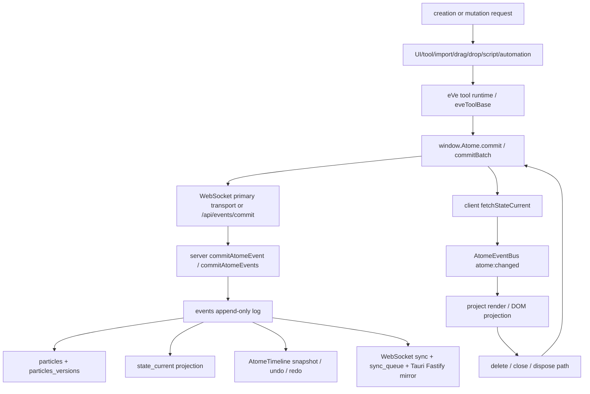

eVe / Atome — Protocole Maître de Debug des Atomes

Objectif Global

Stabiliser définitivement le système des atomes dans Atome / eVe.

Un atome est l’unité fondamentale du runtime Atome.
Il représente un objet vivant pouvant contenir :

* propriétés ;
* rendu ;
* état ;
* historique ;
* interactions ;
* événements ;
* données persistées ;
* relations ;
* permissions ;
* composants UI ;
* médias ;
* références vers des molécules ;
* comportements runtime.

Le but n’est PAS de corriger des symptômes visuels.
Le but est :

* identifier les causes racines ;
* stabiliser le cycle de vie des atomes ;
* empêcher les duplications d’état ;
* empêcher les états fantômes ;
* supprimer les sources de vérité concurrentes ;
* rendre les mutations observables ;
* rendre les comportements reproductibles ;
* empêcher les modifications implicites ;
* fiabiliser la persistance et la reconstruction.

⸻

Règles Absolues

Interdictions

* Pas de fallback runtime.
* Pas de patch rapide.
* Pas de refactorisation globale.
* Pas de duplication de logique.
* Pas de nouvelle source de vérité.
* Pas de mutation silencieuse.
* Pas de try/catch qui masque une erreur.
* Pas de correction cosmétique.
* Pas de watcher supplémentaire pour “réparer” un problème.
* Pas de synchronisation implicite cachée.
* Pas de logique dispersée entre UI et runtime.

⸻

Principe Fondamental

Un atome = une vérité runtime cohérente

Règle fondamentale :

1 atome logique
→ 1 état runtime cohérent
→ 1 cycle de vie observable
→ 1 owner principal

ou :

échec
→ rollback
→ destruction propre
→ aucun état résiduel

⸻

Problèmes Typiques à Détecter

Le système d’atomes peut devenir instable si :

* plusieurs couches modifient le même état ;
* l’UI possède une copie concurrente ;
* les propriétés sont mutées silencieusement ;
* des watchers déclenchent des mutations secondaires ;
* plusieurs renders représentent des états différents ;
* des listeners persistent après destruction ;
* un atome est restauré plusieurs fois ;
* un historique réinjecte un état ancien ;
* plusieurs sources contrôlent les propriétés ;
* un atome est recréé au lieu d’être restauré ;
* la persistance diverge du runtime ;
* des références mortes restent actives.

⸻

Pipeline Théorique d’un Atome

Cycle de vie attendu

requested
→ creating
→ initializing
→ binding-properties
→ rendering
→ ready
→ updating
→ syncing
→ persisting
→ disposing
→ disposed

En cas d’erreur :

failed
→ rollback
→ cleanup
→ disposed

⸻

Sources Possibles de Création d’Atome

Toutes les routes doivent converger vers UNE logique centrale.

Sources possibles

* création UI ;
* import ;
* duplication ;
* restauration projet ;
* chargement historique ;
* création depuis molécule ;
* drag & drop ;
* API runtime ;
* automation ;
* script ;
* synchronisation réseau ;
* synchronisation offline/online ;
* reconstruction état.

⸻

Factory Centrale Obligatoire

Toutes les créations doivent passer par :

createAtome(request)

Interdiction de :

* créer un atome directement depuis UI ;
* muter les propriétés hors pipeline ;
* créer des renders autonomes ;
* restaurer partiellement un atome ;
* bypasser la logique de persistance ;
* contourner le système d’historique.

⸻

Phase 1 — Cartographie

Prompt Audit Principal

Analyse uniquement le pipeline des atomes dans Atome / eVe.
Contexte :
Un atome est l’unité fondamentale du runtime.
Il peut contenir propriétés, rendu, historique, interactions, persistance, médias et références vers des molécules.
Objectif :
cartographier précisément le cycle de vie des atomes.
Ne modifie aucun code.
Produit :

1. points d’entrée ;
2. création des atomes ;
3. mutations des propriétés ;
4. synchronisation ;
5. persistance ;
6. historique ;
7. restauration ;
8. rendu ;
9. destruction ;
10. sources de vérité ;
11. routes concurrentes ;
12. dépendances UI/runtime ;
13. listeners ;
14. watchers ;
15. mutations implicites ;
16. zones pouvant laisser un état fantôme.
Interdictions :

- ne pas corriger ;
* ne pas refactoriser ;
* ne pas ajouter de fallback ;
* ne pas inventer une nouvelle architecture.
Résultat attendu :
un graphe clair du pipeline des atomes.

⸻

Phase 2 — Instrumentation

Objectif

Rendre les mutations d’atomes observables.

⸻

Prompt Instrumentation

À partir du graphe précédent, ajoute une instrumentation temporaire minimale pour observer les atomes.
Objectif :
identifier les mutations incohérentes, duplications d’état et comportements erratiques.
Règles :
* ne corrige rien ;
* ajoute uniquement des logs TEMP_DEBUG ;
* chaque atome doit avoir un atome_runtime_id ;
* tracer les mutations de propriétés ;
* tracer les créations/destructions ;
* tracer les listeners ;
* tracer les watchers ;
* tracer les synchronisations ;
* tracer les restaurations ;
* tracer les changements d’état ;
* tracer les références molécules ;
* tracer les divergences UI/runtime.
Format obligatoire :
TEMP_DEBUG_ATOME {
  atome_id,
  atome_runtime_id,
  source,
  step,
  file,
  function,
  property,
  previous_value,
  next_value,
  renderer_state,
  persistence_state,
  history_state,
  timestamp,
  status,
  error
}
Logger uniquement aux points critiques.

⸻

Phase 3 — Reproduction

Objectif

Transformer les comportements erratiques en scénarios reproductibles.

⸻

Scénarios Obligatoires

Création

* création UI ;
* création via import ;
* duplication ;
* restauration projet ;
* restauration historique ;
* création depuis molécule ;
* drag & drop ;
* synchronisation réseau.

Mutations

* modification propriété ;
* suppression propriété ;
* undo/redo ;
* changement état runtime ;
* synchronisation online/offline ;
* historique ;
* suppression/recréation.

Stress

* multiples updates rapides ;
* suppression pendant render ;
* restauration pendant sync ;
* mutation pendant persistance ;
* double restauration ;
* rollback incomplet.

⸻

Vérifications Obligatoires

Pour chaque scénario :

1 seul owner principal
1 seul état runtime cohérent
aucune mutation silencieuse
aucune propriété divergente
aucun render fantôme
aucun listener zombie
aucune duplication d’atome
aucun historique incohérent
aucune divergence UI/runtime
aucune divergence runtime/persistence

⸻

Phase 4 — Isolation de la Cause Racine

Ennemis Probables

* mutations implicites ;
* propriétés modifiées depuis plusieurs endroits ;
* watchers concurrents ;
* état UI concurrent ;
* historique réinjectant des états obsolètes ;
* persistance asynchrone ;
* rollback incomplet ;
* listeners non nettoyés ;
* références mortes ;
* rendu découplé du runtime ;
* synchronisation offline/online concurrente ;
* atomes recréés au lieu d’être restaurés ;
* cycles de dépendances ;
* duplication de propriétés.

⸻

Phase 5 — Correction

Règle Absolue

Correction minimale.

Pas de réécriture globale.

⸻

Prompt Correction

À partir des logs TEMP_DEBUG et des tests, identifie la cause racine des problèmes d’atomes.
Corrige uniquement la cause racine prouvée.
Contraintes :
* aucune refonte globale ;
* aucun fallback runtime ;
* aucune nouvelle source de vérité ;
* aucune route alternative ;
* aucune correction cosmétique ;
* supprimer tous les logs TEMP_DEBUG après validation ;
* conserver ou ajouter les tests de non-régression.
Priorité absolue :
garantir qu’un atome possède un état runtime cohérent, observable et non dupliqué.
Pour chaque modification :
* fichier ;
* fonction ;
* cause corrigée ;
* comportement avant ;
* comportement après ;
* test associé.

⸻

Signaux d’Alerte Critiques

Extrêmement suspects

* propriété modifiée depuis plusieurs couches ;
* état UI différent du runtime ;
* historique différent du runtime ;
* persistance différente du runtime ;
* render autonome ;
* listeners non supprimés ;
* mutation silencieuse ;
* état global mutable ;
* singleton implicite ;
* cache concurrent ;
* atome restauré plusieurs fois ;
* duplication de propriété ;
* synchronisation implicite ;
* accès direct global à des états runtime.

⸻

Focus spécial : Relations Atome ↔ Molécule

Vérifier spécialement :

* références croisées ;
* ownership ;
* destruction synchronisée ;
* restauration ;
* persistance ;
* timeline liée ;
* médias liés ;
* événements croisés ;
* dispose ;
* rollback.

Principe à garantir :

1 atome
→ référence contrôlée vers 0..N molécules
→ aucune référence morte
→ aucune session fantôme

⸻

Objectif Final

Obtenir un système où :

Un atome =
une entité runtime cohérente,
observable,
reproductible,
non dupliquée,
persistable,
rollbackable,
sans mutation cachée.

Et où :

Toutes les mutations passent par une seule vérité runtime.

⸻

Priorités Réelles

Priorité 1

Stabilité des mutations d’atomes.

Priorité 2

Suppression des sources de vérité multiples.

Priorité 3

Fiabilisation du cycle de vie.

Priorité 4

Nettoyage listeners/watchers/références mortes.

Priorité 5

Synchronisation et persistance.

Priorité 6

Performance.

Les optimisations de performances viennent uniquement après stabilisation complète du runtime des atomes.

⸻

Phase 1 Status — Treated

Point treated: Phase 1 — Atome Pipeline Mapping.

Scope handled in read-only mode:

* mandatory rules reviewed from `.codex/AGENTS.md`;
* canonical Atome structure reviewed from `atome/documentations/atome_structur_to_respect.md`;
* architecture and API maps reviewed from `maps/CODEMAP.md`, `maps/API_MAP.md`, and `maps/ARCHITECTURE_MAP.md`;
* existing graph inventory reviewed from `atome/documentations/graphs/GRAPH_INDEX.md`;
* existing Atome-related graph blocks reviewed for `atome-core`, `runtime-api`, `project-loading`, and `molecule`;
* code entry points verified in `eVe/core/atome_commit.js`, `server/atomeRoutes.orm.js`, `database/adole.js`, and Molecule/project runtime surfaces.

Pipeline map:



Mapped axes:

1. Entry points: `window.Atome.commit`, `window.Atome.commitBatch`, `eveToolBase.createAtome`, import/drop routes, project bootstrap, Molecule group timeline routes, MTraX APIs, server `/api/events/commit`, and database `createAtome`.
2. Creation: UI and tool creation converge mostly through `eveToolBase.createAtome` or direct `window.Atome.commit`; server-side creation can still reach `database.createAtome`.
3. Property mutations: durable visible writes are expected to pass through `window.Atome.commit` or `window.Atome.commitBatch`, then normalized into event payload properties.
4. Synchronization: client commit uses WebSocket or the event HTTP route; Tauri can mirror non-blocking to Fastify; server emits committed Atome sync over WebSocket and may enqueue sync work.
5. Persistence: server commit appends events, updates property/history tables, and materializes `state_current`; direct database helpers also update particles and projection.
6. History: events are append-only; `particles_versions` stores property history; AtomeTimeline reads events and can replay through `commitBatch`.
7. Restoration: project loading uses `loadProjectAtomes`; timeline undo/redo and snapshots can restore current state through commit/replay paths.
8. Rendering: current client state is rendered into project DOM or panel projections; rendering remains a disposable projection by contract.
9. Destruction: delete events mark deleted state; Molecule close routes may either hide panel UI or dispose runtime session depending on path.
10. Sources of truth: events, particles, `state_current`, DOM projection, selection globals, project store, timeline caches, Molecule session state, runtime API singletons.
11. Concurrent routes: project stale-first load, auth/project bootstrap, import/drop, Molecule `openGroupTimeline` versus multi-instance open, timeline replay, Tauri mirror, remote reload.
12. UI/runtime dependencies: eVe UI depends on Atome commit API, project store, runtime globals, panel APIs, Molecule/MTraX window APIs, and event bus notifications.
13. Listeners: Atome event bus, window custom events, auth checked event, project bootstrap listeners, realtime sync listeners, panel/tool state listeners.
14. Watchers: no single canonical watcher owner was proven; async timers, requestAnimationFrame paths, debounce saves, and event listeners behave as watcher-like mutation triggers.
15. Implicit mutations: timeline preview flush before commit, non-blocking mirror, deferred remote reload, selection globals, DOM dataset state, debounce persistence.
16. Ghost-state zones: non-disposed Molecule sessions, panel hidden without session disposal, stale project load promises, detached persistence saves, listener lifecycle gaps, DOM/runtime divergence, Tauri/Fastify mirror divergence.

Critical risks carried into Phase 2:

* `MULTI_SOURCE_OF_TRUTH`: events, `state_current`, particles, DOM, selection globals, timeline cache, project store, and Molecule session state coexist.
* `ASYNC_RISK`: detached mirror writes, stale-first project loading, deferred Molecule saves, timers, and remote reload scheduling.
* `PARTIAL_LIFECYCLE`: Molecule panel close can hide UI without disposing the session; listener ownership is not fully proven.
* `DUPLICATE_CREATION`: Molecule group timeline and multi-instance controllers can create sessions or panels through separate registries.
* `SILENT_ERROR`: several existing catch paths suppress state refresh or downstream handler errors; these must be observed in Phase 2 before any correction.

Next point to treat: Phase 2 — temporary `TEMP_DEBUG_ATOME` instrumentation, limited to the proven critical mutation and lifecycle points above.

⸻

Phase 2 Status — Treated

Point treated: Phase 2 — Temporary Atome Instrumentation.

Instrumentation added:

* `eVe/core/atome_commit.js`: traces `commit` and `commitBatch` before transport and after `state_current` refresh.
* `server/atomeRoutes.orm.js`: traces server event commit intake before and after append.
* `database/adole.js`: traces direct create/update/delete paths and `state_current` projection updates.
* `eVe/intuition/tools/molecule/runtime.js`: traces Molecule group timeline open/close lifecycle.
* `eVe/intuition/tools/molecule/panel/index.js`: traces panel open and UI-only close/hide.
* `eVe/intuition/tools/molecule/session/session.js`: traces session creation, listener add/remove, operation apply/commit, and dispose.
* `eVe/intuition/tools/molecule/persistence/index.js`: traces scheduled, started, completed, and failed Molecule timeline saves.
* `eVe/domains/mtrax/project/commit_bridge_runtime.js`: traces timeline commit requests/results and remote reload sync decisions.

Activation:

* Browser/client traces activate only when `window.__TEMP_DEBUG_ATOME__ === true`.
* Server/database traces activate only when `TEMP_DEBUG_ATOME=1` or `TEMP_DEBUG_ATOME=true`.

Observed fields:

* `atome_id`;
* `atome_runtime_id`;
* `source`;
* `step`;
* `file`;
* `function`;
* `property`;
* `previous_value`;
* `next_value`;
* `renderer_state`;
* `persistence_state`;
* `history_state`;
* `timestamp`;
* `status`;
* `error`.

Validation:

* `node --check eVe/core/atome_commit.js`;
* `node --check server/atomeRoutes.orm.js`;
* `node --check database/adole.js`;
* `node --check eVe/intuition/tools/molecule/runtime.js`;
* `node --check eVe/intuition/tools/molecule/panel/index.js`;
* `node --check eVe/intuition/tools/molecule/session/session.js`;
* `node --check eVe/intuition/tools/molecule/persistence/index.js`;
* `node --check eVe/domains/mtrax/project/commit_bridge_runtime.js`;
* `npm run check:syntax`.

Result:

* Syntax validation passed.
* Instrumentation is temporary and must be removed after Phase 5 validation.

Next point to treat: Phase 3 — deterministic reproduction scenarios using the temporary `TEMP_DEBUG_ATOME` traces.

⸻

Phase 3 Status — Treated

Point treated: Phase 3 — Reproduction.

Reproduced and validated scenarios:

* Molecule undo/redo and persistence: `node tests/probes/molecule_session_history.test.mjs` passed.
* Molecule undo/redo and persistence with `TEMP_DEBUG_ATOME`: `node --input-type=module -e "globalThis.__TEMP_DEBUG_ATOME__=true; await import('./tests/probes/molecule_session_history.test.mjs');"` passed and emitted mutation, history, persistence, and session lifecycle traces.
* MTraX project duplication guard: `node tests/eve/mtrax_project_duplication.sanitization.test.mjs` passed.
* Project drop tool instance contract: `node tests/eve/project_drop_tool_instance_contract.test.mjs` passed.
* ADOLE canonical property persistence: `TEMP_DEBUG_ATOME=1 node database/adole.sanitization.test.mjs` passed and emitted creation/projection traces.
* ADOLE user/project classification: `TEMP_DEBUG_ATOME=1 node database/adole.user_classification.test.mjs` passed and emitted creation/projection traces.
* Direct database creation, mutation, and deletion: a focused `node --input-type=module` scenario passed and emitted create/update/delete/projection traces.

Reproducible blockers found:

* `npm run test:molecule` fails because `eVe/tests/molecule/run_molecule_tests.mjs` is missing.
* `node tests/eve/atome_commit.sanitization.test.mjs` fails in direct Node mode because an import resolves to `/atome/shared/atome_contract.js`; the same file prints its own success line under Vitest but Vitest reports no declared test suite.
* `node tests/probes/eve_runtime_selection_transform_probe.test.mjs` fails because it imports `eve/application/tests/strangler_v2/_env.mjs`, which is absent in this workspace path.
* Browser probes needing Playwright may fail in the sandbox with Chromium Mach port permission errors.
* `node tests/probes/media_import_probe.test.mjs` reaches the app but fails on a 404 for `eve/application/domains/media/media_diagnostics.js`.
* `node tests/probes/mtrack_clip_drag_invariant_probe.test.mjs` had to be stopped after a long run; it emitted an `ok:false` report with repeated `webgpu_no_adapter` diagnostics.

Concrete Atome inconsistency reproduced:

```text
Scenario:
1. Create `child_before_owner` with owner `owner_late` before `owner_late` exists.
2. Create `owner_late`.
3. Run `resolvePendingOwners()`.
4. Read `getAtome('child_before_owner')` and `getStateCurrent('child_before_owner')`.

Observed:
atome_owner_id = "owner_late"
state_owner_id = null
```

Next point to treat: Phase 4 — isolate the root cause of the reproduced `atomes.owner_id` versus `state_current.owner_id` divergence.

⸻

Phase 4 Status — Treated

Point treated: Phase 4 — Root Cause Isolation.

Root cause isolated:

* `database/adole.js#createAtome` supports deferred owner and parent references by storing `_pending_owner_id` and `_pending_parent_id` particles when the referenced Atome does not yet exist.
* `database/adole.js#resolvePendingOwners` later resolves those pending references by updating the `atomes` table and deleting the pending particle.
* The same function does not update `state_current.owner_id` or the projected parent metadata after resolving the pending reference.

Proven effect:

* `atomes.owner_id` becomes correct after deferred owner resolution.
* `state_current.owner_id` remains stale.
* Runtime reads through `getStateCurrent` can therefore observe a different owner than persistence identity reads through `getAtome`.

Cause category:

* `MULTI_SOURCE_OF_TRUTH`;
* `runtime/persistence divergence`;
* `partial lifecycle repair`;
* `implicit state projection drift`.

Next point to treat: Phase 5 — correct only `resolvePendingOwners` so deferred owner/parent resolution also keeps `state_current` coherent, add a regression test, validate, then remove all temporary `TEMP_DEBUG_ATOME` instrumentation.

⸻

Phase 5 Status — Treated

Point treated: Phase 5 — Root Cause Correction.

Correction applied:

* `database/adole.js#resolvePendingOwners` now updates `state_current.owner_id` when `_pending_owner_id` is resolved.
* `database/adole.js#resolvePendingOwners` now updates the projected `parent_id` property and fills `state_current.project_id` when `_pending_parent_id` is resolved and the projection did not already have a project id.

Cause corrected:

* Deferred owner/parent repair previously updated only the identity table.
* Current-state projection metadata could remain stale after the identity layer was repaired.

Behavior before:

```text
getAtome('child_before_owner').owner_id = "owner_late"
getStateCurrent('child_before_owner').owner_id = null
```

Behavior after:

```text
getAtome('child_before_owner').owner_id = "owner_late"
getStateCurrent('child_before_owner').owner_id = "owner_late"
```

Regression test added:

* `database/adole.sanitization.test.mjs` — `ADOLE pending owner resolution keeps state_current owner coherent`.

Map updates:

* `maps/ARCHITECTURE_MAP.md` documents that pending owner/parent resolution must repair both `atomes` and `state_current`.
* `maps/API_MAP.md` documents the `resolvePendingOwners` projection-coherence contract.

Temporary instrumentation cleanup:

* All `TEMP_DEBUG_ATOME` code added during Phase 2 was removed from source files after validation.
* A source scan confirmed no `TEMP_DEBUG_ATOME`, `emitTempDebugAtome`, or `tempDebugAtome` markers remain in the touched code paths.

Final validation:

* `node --check database/adole.js`;
* `node --check eVe/core/atome_commit.js`;
* `node --check server/atomeRoutes.orm.js`;
* `node database/adole.sanitization.test.mjs`;
* `node tests/probes/molecule_session_history.test.mjs`;
* `node tests/eve/mtrax_project_duplication.sanitization.test.mjs`;
* `node tests/eve/project_drop_tool_instance_contract.test.mjs`;
* focused reproduction script confirming `atome_owner_id` and `state_owner_id` both equal `"owner_late"`;
* `npm run check:syntax`.

Residual blockers documented during Phase 3:

* Some browser/probe scenarios remain blocked by sandboxed Chromium permissions, missing workspace paths, or stale test harness paths.
* Those blockers are reproducible but separate from the corrected root cause above.
