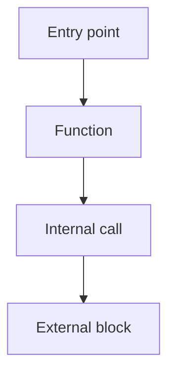
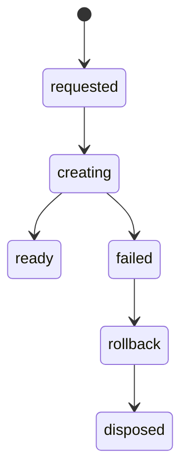

# Prompt — Création des Graphes de Debug eVe / Atome

## Objectif

Créer une cartographie technique exploitable pour debugger les gros blocs du framework eVe / Atome.

Le but n’est pas de produire une documentation décorative.
Le but est de créer des graphes permettant d’identifier :

* les routes concurrentes ;
* les doubles créations ;
* les sources de vérité multiples ;
* les états fantômes ;
* les appels async dangereux ;
* les mutations cachées ;
* les dépendances bloquantes ;
* les cycles de vie incomplets ;
* les zones responsables de comportements erratiques.

---

# Prompt principal à donner à l’IA

````md
Tu dois créer une cartographie technique de debug pour le framework eVe / Atome.

Le framework est volumineux. Tu ne dois pas essayer de tout corriger ni tout refactoriser.
Ta tâche est uniquement de produire des graphes techniques précis, lisibles et exploitables pour le debug.

## Blocs à cartographier

Crée une cartographie séparée pour chacun des blocs suivants :

1. atome-core
2. molecule
3. boot
4. user-login
5. project-loading
6. sequence-timeline
7. media-import
8. media-recording
9. panel-lifecycle
10. runtime-api

Chaque bloc doit avoir son propre dossier :

```txt
/docs/graphs/atome-core/
/docs/graphs/molecule/
/docs/graphs/boot/
/docs/graphs/user-login/
/docs/graphs/project-loading/
/docs/graphs/sequence-timeline/
/docs/graphs/media-import/
/docs/graphs/media-recording/
/docs/graphs/panel-lifecycle/
/docs/graphs/runtime-api/
````

## Format obligatoire

Utilise uniquement des fichiers Markdown `.md` avec diagrammes Mermaid.

Chaque dossier doit contenir :

```txt
README.md
01-call-graph.md
02-event-graph.md
03-state-graph.md
04-source-of-truth-graph.md
05-async-graph.md
06-lifecycle-graph.md
07-risk-map.md
08-open-questions.md
```

---

# Règles absolues

## Interdictions

* Ne modifie aucun fichier source.
* Ne corrige aucun bug.
* Ne refactorise rien.
* N’ajoute aucun fallback.
* N’ajoute aucun log.
* Ne crée aucune nouvelle architecture.
* Ne suppose pas qu’une fonction existe si elle n’est pas trouvée.
* Ne remplace pas une zone inconnue par une invention.
* Ne mélange pas tous les blocs dans un seul graphe géant.

## Obligations

* Lire le code réellement présent.
* Citer les fichiers et fonctions trouvés.
* Marquer les zones incertaines avec `UNKNOWN`.
* Marquer les zones risquées avec `RISK`.
* Marquer les routes concurrentes avec `CONFLICT`.
* Marquer les sources de vérité multiples avec `MULTI_SOURCE_OF_TRUTH`.
* Marquer les appels async sensibles avec `ASYNC_RISK`.
* Marquer les créations/destructions partielles avec `PARTIAL_LIFECYCLE`.
* Marquer les dépendances circulaires avec `CYCLE_RISK`.

---

# Types de graphes à produire

Pour chaque bloc, produire les graphes suivants.

---

## 1. Call Graph

Fichier :

```txt
01-call-graph.md
```

Objectif :
montrer qui appelle qui.

Le graphe doit inclure :

* points d’entrée ;
* fonctions principales ;
* appels internes ;
* appels vers d’autres blocs ;
* API publiques ;
* appels runtime ;
* fichiers concernés.

Format Mermaid recommandé :



Chaque nœud doit indiquer si possible :

```txt
fonction\nfichier:ligne
```

---

## 2. Event Graph

Fichier :

```txt
02-event-graph.md
```

Objectif :
identifier les événements qui déclenchent du code.

Le graphe doit inclure :

* événements UI ;
* événements runtime ;
* custom events ;
* watchers ;
* observers ;
* listeners ;
* callbacks ;
* événements déclenchés automatiquement ;
* risques de double déclenchement.

Marquer avec `CONFLICT` tout événement qui peut déclencher la même action qu’un autre chemin.

---

## 3. State Graph

Fichier :

```txt
03-state-graph.md
```

Objectif :
montrer les états possibles du bloc.

Le graphe doit inclure :

* état initial ;
* états intermédiaires ;
* état ready ;
* état failed ;
* état disposed ;
* états partiels ;
* transitions interdites ;
* transitions non protégées.

Exemple attendu :



---

## 4. Source-of-Truth Graph

Fichier :

```txt
04-source-of-truth-graph.md
```

Objectif :
identifier où vit la donnée réelle.

Le graphe doit montrer :

* source de vérité principale ;
* états secondaires ;
* caches ;
* états UI ;
* états runtime ;
* états persistés ;
* états temporaires ;
* divergences possibles.

Marquer avec `MULTI_SOURCE_OF_TRUTH` toute donnée contrôlée par plusieurs endroits.

Questions à résoudre :

* Qui possède réellement l’état ?
* Qui peut le modifier ?
* Qui peut le lire ?
* Qui peut le reconstruire ?
* Qui peut le supprimer ?
* Existe-t-il une copie concurrente ?

---

## 5. Async Graph

Fichier :

```txt
05-async-graph.md
```

Objectif :
visualiser les promesses, callbacks, awaits, timers et risques de race condition.

Inclure :

* promises ;
* async/await ;
* callbacks ;
* timers ;
* requestAnimationFrame ;
* setTimeout ;
* file loading ;
* media loading ;
* audio init ;
* renderer init ;
* network calls ;
* storage calls.

Marquer avec `ASYNC_RISK` :

* await manquant ;
* promesse non retournée ;
* ordre non garanti ;
* init parallèle dangereuse ;
* état modifié après dispose ;
* callback pouvant arriver après destruction.

---

## 6. Lifecycle Graph

Fichier :

```txt
06-lifecycle-graph.md
```

Objectif :
montrer le cycle complet de création, usage et destruction.

Inclure :

* create ;
* init ;
* bind ;
* ready ;
* update ;
* pause ;
* stop ;
* save ;
* close ;
* dispose ;
* cleanup ;
* rollback.

Marquer avec `PARTIAL_LIFECYCLE` :

* objet créé sans dispose ;
* listener ajouté sans remove ;
* session créée sans cleanup ;
* renderer créé sans destruction ;
* audio ouvert sans fermeture ;
* timeline créée sans owner clair.

---

## 7. Risk Map

Fichier :

```txt
07-risk-map.md
```

Objectif :
lister les risques concrets détectés.

Format obligatoire :

```md
| Niveau | Type | Fichier | Fonction | Problème | Impact possible | Preuve | Action recommandée |
|---|---|---|---|---|---|---|---|
| High | MULTI_SOURCE_OF_TRUTH | path/file.js | functionName | ... | ... | ligne / appel trouvé | ... |
```

Niveaux :

* Critical
* High
* Medium
* Low
* Unknown

Types :

* MULTI_SOURCE_OF_TRUTH
* CONFLICT
* ASYNC_RISK
* PARTIAL_LIFECYCLE
* CYCLE_RISK
* DUPLICATE_CREATION
* SILENT_ERROR
* GLOBAL_STATE
* DEAD_CODE
* LEGACY_PATH
* PERFORMANCE_BLOCKER

---

## 8. Open Questions

Fichier :

```txt
08-open-questions.md
```

Objectif :
lister ce qui n’est pas prouvé.

Format :

```md
# Open Questions — [bloc]

## UNKNOWN-001

Question :
...

Pourquoi c’est important :
...

Fichiers concernés :
...

Comment vérifier :
...
```

---

# Focus spécial : Molecule

Le bloc `molecule` est prioritaire.

Pour ce bloc, vérifie spécialement :

* toutes les routes de création ;
* import audio ;
* import vidéo ;
* enregistrement audio ;
* enregistrement vidéo ;
* saisie texte ;
* ouverture MTraX ;
* atome_mtrack_open_request ;
* window.Molecule ;
* molecule.api.js ;
* MoleculeSession ;
* timeline ;
* transport ;
* renderer WebGPU ;
* audio natif ;
* dispose ;
* rollback ;
* session fantôme ;
* double création.

Principe à vérifier :

```txt
1 intention utilisateur
→ 1 molecule_creation_id
→ 1 MoleculeSession complète
```

ou :

```txt
échec
→ rollback
→ 0 session fantôme
```

Si plusieurs chemins peuvent créer une molécule pour une seule intention utilisateur, marquer :

```txt
DUPLICATE_CREATION
CONFLICT
```

---

# Focus spécial : Boot

Pour le bloc `boot`, produire aussi une timeline chronologique :

```txt
/docs/graphs/boot/09-boot-timeline.md
```

Elle doit indiquer :

* modules chargés ;
* ordre d’initialisation ;
* appels bloquants ;
* appels réseau ;
* accès disque ;
* init UI ;
* init runtime ;
* init audio ;
* init renderer ;
* init projet ;
* éléments qui peuvent être lazy-loaded.

---

# Focus spécial : Project Loading

Pour `project-loading`, vérifier :

* chargement projet ;
* restauration scène ;
* restauration atomes ;
* restauration molécules ;
* médias liés ;
* permissions ;
* historique ;
* état user ;
* sources persistées ;
* sources runtime ;
* conflits online/offline.

---

# README attendu pour chaque bloc

Chaque `README.md` doit contenir :

```md
# Graphs — [Bloc]

## Purpose

Ce dossier cartographie le bloc [Bloc] pour faciliter le debug.

## Files analyzed

- path/file.js
- path/file.md

## Main entry points

- functionName
- eventName
- APIName

## Main risks found

- RISK-001
- RISK-002

## Graphs

- 01-call-graph.md
- 02-event-graph.md
- 03-state-graph.md
- 04-source-of-truth-graph.md
- 05-async-graph.md
- 06-lifecycle-graph.md
- 07-risk-map.md
- 08-open-questions.md
```

---

# Méthode de travail obligatoire

Procède bloc par bloc.

Ordre conseillé :

1. molecule
2. media-import
3. media-recording
4. panel-lifecycle
5. sequence-timeline
6. project-loading
7. user-login
8. boot
9. runtime-api
10. atome-core

Pour chaque bloc :

1. localiser les fichiers ;
2. identifier les points d’entrée ;
3. suivre les appels ;
4. repérer les événements ;
5. repérer les états ;
6. repérer les sources de vérité ;
7. repérer les async ;
8. repérer les cycles de vie ;
9. produire les graphes ;
10. produire la risk map ;
11. produire les questions ouvertes.

---

# Résultat final attendu

À la fin, produire :

```txt
/docs/graphs/GRAPH_INDEX.md
```

Ce fichier doit contenir :

* liste de tous les blocs cartographiés ;
* liens vers chaque dossier ;
* risques critiques globaux ;
* routes concurrentes globales ;
* sources de vérité multiples globales ;
* priorités de debug ;
* ordre recommandé de correction.

---

# Priorité de debug attendue

La priorité absolue est :

```txt
molecule → media-import → media-recording → panel-lifecycle → sequence-timeline
```

Les performances boot/login/project-loading viennent après la stabilisation de la molécule.

---

# Sortie attendue

Ne fournis pas seulement une explication.
Crée réellement les fichiers `.md` dans `/docs/graphs/`.

Ne modifie aucun fichier source.
Ne corrige aucun code.
Ne fais que cartographier.

````

---

# Version courte du prompt

```md
Crée des graphes Mermaid de debug pour les blocs principaux eVe / Atome.

Blocs :
- molecule ;
- media-import ;
- media-recording ;
- panel-lifecycle ;
- sequence-timeline ;
- project-loading ;
- user-login ;
- boot ;
- runtime-api ;
- atome-core.

Pour chaque bloc, crée dans `/docs/graphs/[bloc]/` :

- README.md ;
- 01-call-graph.md ;
- 02-event-graph.md ;
- 03-state-graph.md ;
- 04-source-of-truth-graph.md ;
- 05-async-graph.md ;
- 06-lifecycle-graph.md ;
- 07-risk-map.md ;
- 08-open-questions.md.

Objectif :
trouver les doubles créations, sources de vérité multiples, routes concurrentes, bugs async, états fantômes, cycles de vie incomplets et dépendances bloquantes.

Règles :
- ne modifie aucun code source ;
- ne corrige rien ;
- ne refactorise rien ;
- utilise uniquement Markdown + Mermaid ;
- cite les fichiers et fonctions trouvés ;
- marque UNKNOWN, RISK, CONFLICT, MULTI_SOURCE_OF_TRUTH, ASYNC_RISK, PARTIAL_LIFECYCLE ;
- priorité absolue : molecule.

Résultat final :
crée aussi `/docs/graphs/GRAPH_INDEX.md` avec les risques critiques et l’ordre recommandé de debug.
````
