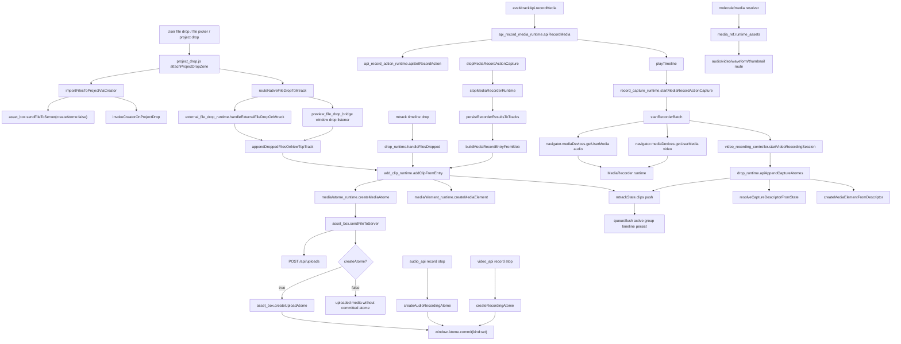

# Import And Record Debug Progress

## Status

- Phase 1 - Cartography: treated.
- Phase 2 - Instrumentation: treated.
- Phase 3 - Reproduction: pending.
- Phase 4 - Root cause isolation: pending.
- Phase 5 - Correction and cleanup: pending.

## Phase 1 - Cartography

Point treated: Phase 1 cartography.

### Existing Architecture References Used

- `atome/documentations/graphs/media-import/README.md`
- `atome/documentations/graphs/media-import/01-call-graph.md`
- `atome/documentations/graphs/media-import/04-source-of-truth-graph.md`
- `atome/documentations/graphs/media-recording/01-call-graph.md`
- `atome/documentations/graphs/media-recording/04-source-of-truth-graph.md`
- `atome/documentations/graphs/media-recording/05-async-graph.md`
- `atome/documentations/graphs/molecule/01-call-graph.md`
- `atome/documentations/graphs/sequence-timeline/01-call-graph.md`

### Files Inspected

- `eVe/domains/mtrax/clips/add_clip_runtime.js`
- `eVe/domains/mtrax/media/drop_runtime.js`
- `eVe/domains/mtrax/media/record_capture_runtime.js`
- `eVe/domains/mtrax/media/atome_runtime.js`
- `eVe/domains/mtrax/integration/external_file_drop_runtime.js`
- `eVe/domains/mtrax/preview/preview_file_drop_bridge.js`
- `eVe/domains/mtrax/api/api_record_media_runtime.js`
- `eVe/domains/mtrax/api/api_record_action_runtime.js`
- `eVe/domains/media/asset_box.js`
- `eVe/domains/media/api/audio_api.js`
- `eVe/domains/media/api/video_api.js`
- `eVe/domains/media/api/video_recording_controller.js`
- `eVe/domains/media/api/media_api_shared.js`
- `eVe/intuition/tools/project_drop.js`
- `eVe/intuition/tools/molecule/media/index.js`
- `eVe/intuition/tools/mtrack.js`
- `eVe/core/atome_commit.js`
- `atome/src/application/examples/user.js`
- `eVe/intuition/tools/communication.js`

### Critical Finding

The mandatory factory `createAtomeFromMedia(request)` is not implemented in the runtime. It appears only in `todo/import_and_record_debug.md`. Current media routes create or reuse atomes through several separate surfaces:

- `eVe/domains/media/asset_box.js` via `sendFileToServer()` and `createUploadAtome()`.
- `eVe/domains/media/api/audio_api.js` via `createAudioRecordingAtome()`.
- `eVe/domains/media/api/video_api.js` via `createRecordingAtome()`.
- `eVe/intuition/tools/project_drop.js` via upload with `createAtome: false`, followed by project creator invocation.
- `eVe/domains/mtrax/media/record_capture_runtime.js` via recording blob entries and `addClipFromEntry(..., createSourceAtome: false)`.
- Native video recording path via `appendCaptureAtomes()` after native capture returns an atome id.

No current route provides a guaranteed `media_operation_id`, `media_asset_id`, or `atome_runtime_id`.

### Real Execution Graph



### Required Audit Items

1. Media entry points:
   - MTrack timeline file drop through `drop_runtime.handleFilesDropped()`.
   - MTrack preview/external file drop through `external_file_drop_runtime.handleExternalFileDropOnMtrack()`.
   - Window preview file drop bridge through `preview_file_drop_bridge`.
   - Project surface drop through `project_drop.attachProjectDropZone()`.
   - aBox global upload drop through `asset_box.uploadDroppedFiles()`.
   - MTrack record media API through `api_record_media_runtime.apiRecordMedia()`.
   - Audio API direct recording through `audio_api`.
   - Video API direct recording through `video_api` and `video_recording_controller`.
   - Native video capture append through `drop_runtime.apiAppendCaptureAtomes()`.
   - Molecule media playback resolution through `molecule/media/index.js`.

2. Real call order:
   - Imports to MTrack: drop event -> `addClipFromEntry()` -> `createMediaAtome()` -> `sendFileToServer()` -> optional `createUploadAtome()` -> `createMediaElement()` -> `mtrackState.clips.push()` -> timeline persist.
   - Project drops: drop event -> `sendFileToServer(createAtome:false)` -> `invokeCreatorOnProjectDrop()` -> creator gateway persists visual atome.
   - Recording to MTrack: `apiRecordMedia(start)` -> record action state -> timeline play -> `startMediaRecordActionCapture()` -> capture runtime -> `stopMediaRecordActionCapture()` -> blob entry -> `addClipFromEntry(createSourceAtome:false)` -> timeline persist.
   - Native video recording: native stop returns atome id -> `appendCaptureAtomes()` -> descriptor -> clip creation -> timeline persist.

3. Files involved:
   - Listed in "Files Inspected".

4. Functions involved:
   - `addClipFromEntry`, `createMediaAtome`, `sendFileToServer`, `createUploadAtome`, `createMediaElement`, `createMediaElementFromDescriptor`, `apiRecordMedia`, `apiSetRecordAction`, `startMediaRecordActionCapture`, `stopMediaRecordActionCapture`, `persistRecorderResultsToTracks`, `createAudioRecordingAtome`, `createRecordingAtome`, `appendCaptureAtomes`, `invokeCreatorOnProjectDrop`.

5. Async callbacks:
   - Drag/drop `onDrop` callbacks.
   - `MediaRecorder` `dataavailable`, `stop`, and `error` listeners.
   - `getUserMedia` permission promises.
   - `appendDroppedFilesOnNewTopTrack()` launched with `void` in preview bridge.
   - `flushActiveGroupTimelinePersist()` launched with `void` in recording persistence.
   - Native video stop uses `Promise.race()` with finalize timeout.

6. Media objects created:
   - Uploaded `Blob`/`File` entries.
   - Browser `MediaStream`.
   - `MediaRecorder` runtime with `chunks`.
   - Recording `Blob`.
   - DOM media elements from `createMediaElement()` and `createMediaElementFromDescriptor()`.
   - Timeline clip media payloads with `resolvedSource` and `runtimePlaybackSource`.

7. Atomes created:
   - Upload atomes through `createUploadAtome()`.
   - Audio recording atomes through `createAudioRecordingAtome()`.
   - Video recording atomes through `createRecordingAtome()`.
   - Project visual atomes through project creator gateway after upload-only media.
   - Native video atomes produced by native recording and appended later.

8. Molecule links:
   - No direct automatic molecule creation found in inspected media import/record paths.
   - Molecule playback resolves from `media_ref.runtime_assets`, which is a separate source from timeline clip `src` and atome media properties.

9. Temporary files:
   - Upload storage is server-managed under `/api/uploads`.
   - Recording storage is under `/api/recordings` or user-scoped local paths.
   - Browser audio can use IndexedDB for local recording cache.
   - No unified temp owner/cleanup state was found in the media-to-atome path.

10. Persistence:
   - Atome persistence uses `window.Atome.commit(kind:set)`.
   - Timeline persistence uses active group timeline schedule/flush helpers.
   - Project drop can persist a visual atome separately from media upload.
   - Recording APIs can persist media before atome creation.

11. Rollback:
   - No complete media -> atome transaction rollback was found.
   - Upload success followed by atome creation failure can return failed creation after media storage exists.
   - Recording local/cloud save failures are not governed by one rollback coordinator.
   - Some stream cleanup exists, but it is not a full media/atome/molecule rollback.

12. Media sources of truth:
   - Uploaded file path.
   - `/api/uploads` URL.
   - `/api/recordings` URL.
   - `media_url`, `src`, `file_path`, `runtimePlaybackSource`.
   - `media_ref.runtime_assets`.
   - Timeline clip `src`.

13. Atome sources of truth:
   - `window.Atome.commit` state.
   - Project creator gateway result.
   - Native recording result atome id.
   - MTrack clip `atomeId`.
   - Project visual DOM metadata in legacy visual runtimes.

14. Concurrent routes:
   - Project drop can route to MTrack or project creator.
   - Preview file bridge uses global window listeners and async `void` processing.
   - MTrack timeline drop and preview drop can both target `addClipFromEntry()`.
   - Direct audio/video APIs can create recording atomes outside MTrack.
   - Native video append route bypasses upload/blob path.

15. Media without atome risk:
   - `sendFileToServer(createAtome:false)` intentionally stores media without immediately creating the upload atome.
   - Recording blob entries use `addClipFromEntry(createSourceAtome:false)`, producing clips with uploaded media but no source atome from that route.
   - Failed `createUploadAtome()` after successful upload can leave stored media.

16. Atome without valid media risk:
   - `createUploadAtome()` commits after upload but before runtime media element validation in `addClipFromEntry()`.
   - `createAudioRecordingAtome()` and `createRecordingAtome()` commit after persistence but without a central metadata validation contract.
   - Native recording atome id may be appended before descriptor media source is fully validated.

17. Multiple atomes for one media risk:
   - Project drop upload-only route creates an upload id and then creator gateway can create a separate visual atome.
   - Direct recording APIs and MTrack recording path can be invoked independently for the same user intention.
   - Preview bridge and project drop routing can both observe native files unless guards are complete.

18. Multiple media attached to one atome risk:
   - Project creator receives upload result plus media fields and can create/update visual state independently.
   - Atome properties include several media fields (`media_url`, `src`, `file_path`) without one enforced owner contract.
   - Molecule `media_ref.runtime_assets` is independent from MTrack clip source fields.

### Phase 1 Conclusion

The current system does not yet satisfy the protocol invariant:

```txt
1 user media intention -> 1 media_operation_id -> 1 validated media -> 1 atome
```

The first candidate root architectural issue is not a single callback bug. It is the absence of one central media-to-atome operation owner. Phase 2 must instrument the existing owners before any correction:

- upload/import owner: `asset_box.sendFileToServer()` and `createUploadAtome()`;
- MTrack clip owner: `add_clip_runtime.addClipFromEntry()`;
- MTrack capture append owner: `drop_runtime.apiAppendCaptureAtomes()`;
- recording owner: `record_capture_runtime` plus direct `audio_api` and `video_api`;
- project drop owner: `project_drop.importFilesToProjectViaCreator()`.

## Phase 2 - Instrumentation

Point treated: Phase 2 instrumentation.

### Instrumented Files

- `eVe/domains/mtrax/clips/add_clip_runtime.js`
- `eVe/domains/mtrax/media/drop_runtime.js`
- `eVe/domains/mtrax/media/atome_runtime.js`
- `eVe/domains/mtrax/media/record_capture_runtime.js`
- `eVe/domains/media/api/audio_api.js`
- `eVe/domains/media/api/video_api.js`

### Instrumentation Scope

Temporary `TEMP_DEBUG_MEDIA_ATOME` logs now trace:

- operation request;
- upload/acquisition;
- media element or descriptor resolution;
- atome creation or missing atome owner;
- clip binding;
- recording start, stream acquisition, stop/finalization result, and clip persistence scheduling;
- direct audio/video recording atome commits.

### Required Log Shape

The temporary logs use this object shape:

```txt
TEMP_DEBUG_MEDIA_ATOME {
  media_operation_id,
  source,
  step,
  file,
  function,
  media_type,
  media_asset_id,
  temp_file_id,
  atome_id,
  atome_runtime_id,
  molecule_id,
  timeline_id,
  metadata_state,
  persistence_state,
  rollback_state,
  timestamp,
  status,
  error
}
```

### Syntax Validation

Treated validations:

- `node --check eVe/domains/mtrax/clips/add_clip_runtime.js`
- `node --check eVe/domains/mtrax/media/drop_runtime.js`
- `node --check eVe/domains/mtrax/media/atome_runtime.js`
- `node --check eVe/domains/mtrax/media/record_capture_runtime.js`
- `node --check eVe/domains/media/api/audio_api.js`
- `node --check eVe/domains/media/api/video_api.js`
- `node --check eVe/domains/media/asset_box.js`
- `node --check eVe/intuition/tools/project_drop.js`

All targeted syntax validations passed.
