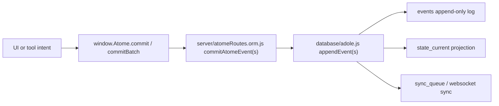
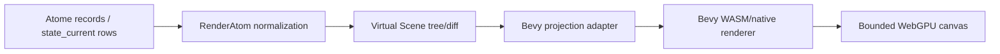
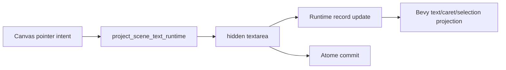

# Full Atome Architecture Audit - Inline Editing, Accessibility Graph, Bevy Projection

Date: 2026-06-12

Source prompt: `todo/prompt_audit_architecture_atomes_edition_inline_v2_accessibilite_graphe.md`

Scope: static architecture audit only. No product code was modified and no new runtime code was created.

## 1. Executive Verdict

Overall verdict: NO-GO for implementing the requested inline-edit/accessibility feature as production-ready without prior architecture work.

The current system already has important foundations:

- A canonical persistence model with `atomes`, `particles`, append-only `events`, `state_current`, snapshots, permissions, and sync queues.
- A central commit path through `window.Atome.commit/commitBatch`, server `commitAtomeEvent(s)`, and database `appendEvent(s)`.
- A modern active project rendering path: Atome records -> RenderAtom -> Virtual Scene -> Bevy projection -> WebGPU/canvas.
- A hidden text service for active project text editing, with visible text remaining in the canvas route.
- A Virtual Scene hierarchy and an `AccessibilityDirty` diff concept.

However, several requested requirements are not yet fully satisfied:

- There is no first-class, canonical `AtomGraph`/accessibility graph model with semantic roles, labels, reading order, focus order, relationships, alternate text, captions, transcripts, or assistive actions.
- Accessibility metadata is only an arbitrary `properties.accessibility` object in the Virtual Scene. It is not schema-governed, not projected to Bevy payloads, and not exposed through a screen-reader/accessibility bridge.
- Perfect undo/redo after restart is not proven. The event log exists, but timeline undo has in-memory redo snapshots, legacy DOM replay paths, and DB helper defects around particle history.
- The kind/type registry exists as a framework, but the active renderer still normalizes concrete kinds through heuristics and supports only `shape`, `text`, `image`, `video`, and `audio_waveform`.
- Legacy DOM editing, drag, and timeline replay paths still coexist with the active canvas route. They must either be isolated as non-project legacy or retired before treating Bevy/canvas as the only edit surface.

Final recommendation: do not implement the requested inline edit mode directly. First develop the missing architecture concepts listed in section 11, then implement the feature on top of those contracts.

## 2. Inputs Reviewed

Primary audit prompt:

- `todo/prompt_audit_architecture_atomes_edition_inline_v2_accessibilite_graphe.md`

Mandatory/routing rule modules:

- `.codex/modules/01-root-constitution.md`
- `.codex/modules/02-coding-standards-and-prohibitions.md`
- `.codex/modules/03-debugging-testing-and-ui-validation.md`
- `.codex/modules/04-feature-work-cleanup-and-framework-reuse.md`
- `.codex/modules/05-api-rendering-and-ui.md`
- `.codex/modules/06-atome-state-sync-and-runtime-modes.md`
- `.codex/modules/07-future-code-guardrails.md`

Architecture and design references:

- `maps/DESIGN_MAP.md`
- `maps/API_MAP.md`
- `maps/ARCHITECTURE_MAP.md`
- `maps/CODEMAP.md`
- `done/actual_menu.md`
- `atome/documentations/atome_structur_to_respect.md`
- `atome/documentations/how_to_read_atome_from_base.md`
- `atome/documentations/bevy_integration.md`
- `eVe/documentations/atome_persistence_contract.md`
- `eVe/documentations/atome_concepts.md`
- `eVe/documentations/eVe_canvas.md`
- `atome/documentations/how_debug_UI.md`
- `todo/eve_features/eve_accessibility.md`

Unavailable or renamed references:

- `ui_project_system_specification_v146_MVP_consolidated.md` was referenced by prompts but was not found in the workspace.
- `prompt_modification_menu_mvp_v146_ios_touch_tests(1).md` was not found. The available equivalent `todo/prompt_modification_menu_mvp_v146_ios_touch_tests.md` was inspected.

Code areas reviewed:

- Persistence: `database/schema.sql`, `database/adole.js`, `server/atomeRoutes.orm.js`
- Commit/timeline: `eVe/core/atome_commit.js`, `eVe/core/atome_timeline.js`, `eVe/intuition/tools/undo.js`
- Rendering: `eVe/domains/rendering/render_atom.js`, `virtual_scene_contract.js`, `bevy_projection_adapter.js`, `project_scene_runtime.js`, `surface_runtime.js`
- Text editing: `hidden_text_service_runtime.js`, `project_scene_text_runtime.js`, legacy `eVe/core/atome_events/text_edit_runtime.js`
- UI/menu/footer/dock: `eVe/intuition/eVeIntuition.js`, `eVe/intuition/ribbon/menu.js`, `eVe/intuition/runtime/mtrack_dock_controller.js`, `eVe/domains/mtrax/ui/docked_renderer_runtime.js`
- Contract tests under `tests/eve/` and `database/*.test.mjs`

No tests were executed for this audit. Existing test sources were inspected as evidence.

## 3. Compliance Table

| Requirement | Status | Evidence | Blocking Gap |
| --- | --- | --- | --- |
| Atome model can represent a hierarchy/tree | PARTIAL | `database/schema.sql:44-63` has `atomes.parent_id`; `virtual_scene_contract.js:126-163` builds a tree from parent ids. | This is a tree projection, not a named `AtomGraph` domain with ordering, semantics, graph relations, or accessibility relations. |
| Bevy is a view/projection, not source of truth | MOSTLY OK on active project route | `maps/DESIGN_MAP.md:169-176`; `project_scene_runtime.js:81-155`; `database/schema.sql:11-16`. | Legacy DOM replay/edit paths still mutate visible DOM directly. |
| Kinds are extensible | PARTIAL | `atome_universal_contract.js:216-235` registers type definitions. | Active renderer kind support is hard-coded/heuristic in `render_atom.js:44-72` and `bevy_projection_adapter.js:79-85`. |
| Text inline editing exists for active project scene | PARTIAL/OK foundation | `hidden_text_service_runtime.js:21-49`; `project_scene_text_runtime.js:38-60`; `tests/eve/project_scene_text_edit_contract.test.mjs:59-137`. | Not yet a generic `InlineEditMode` with persistent rename semantics, accessibility focus semantics, close overlay, graph metadata, and touch/keyboard equivalents. |
| Undo/redo survives restart perfectly | NOT PROVEN | Events exist (`schema.sql:144-158`), timeline loads events (`atome_timeline.js:1026-1066`). | Redo snapshots are in memory (`atome_timeline.js:1133-1175`); DB history helpers have schema mismatches (`adole.js:1178-1208`); legacy replay writes DOM. |
| Accessibility graph is sufficient | BLOCKING PARTIAL | Virtual Scene has `accessibility` field and diff (`virtual_scene_contract.js:3-27`, `:119-121`, `:215-220`). | No canonical semantic schema, no Bevy payload mapping, no ARIA/reader bridge, no reading/focus order, no accessibility tests proving user navigation. |
| Dock removal is safe/out of scope | OUT OF SCOPE, COUPLING PRESENT | Prompt says dock is out of scope. Current double-click media flow routes to MTraX/dock (`eVeIntuition.js:10065-10181`). | Future removal must isolate MTraX/dock coupling from inline edit/footer behavior. |
| DOM remains disposable/minimal | PARTIAL | Active project tests assert no per-Atome DOM (`tests/eve/project_scene_text_edit_contract.test.mjs:89-90`; `maps/DESIGN_MAP.md:171-176`). | Legacy timeline/text/drag paths still create/edit DOM and `contentEditable`. |

## 4. Current Architecture Mapping

### 4.1 Persistence and Mutation Flow

Current canonical path:



Evidence:

- `database/schema.sql:6-18` defines the intended canonical mapping: `events` are the durable replay source, `state_current` is a projection cache, and snapshots must not replace history.
- `server/atomeRoutes.orm.js:166-225` commits authenticated events and batches through database append functions.
- `database/adole.js:1399-1514` appends events inside transactions and applies them to `state_current`.

Assessment:

- The event-sourced foundation is real.
- The implementation still has legacy side channels and helper defects that prevent a strong "perfect restart undo" claim.

### 4.2 Active Rendering Flow

Current active project rendering path:



Evidence:

- `maps/DESIGN_MAP.md:169-176` states that the active project route is a bounded project canvas, with text editing using the hidden text service and visible text staying in Bevy.
- `project_scene_runtime.js:81-155` normalizes records, builds a Virtual Scene, calls Bevy projection, and stores the projection result.
- `tests/eve/virtual_scene_phase1_contract.test.mjs:63-114` verifies deterministic hierarchy and accessibility diff separation.

Assessment:

- Active project rendering is aligned with the requested "Bevy is a view" principle.
- The system still has older DOM paths that need explicit lifecycle boundaries.

### 4.3 Text Editing Flow

Active project text editing path:



Evidence:

- `hidden_text_service_runtime.js:21-49` mounts one hidden textarea and focuses it.
- `project_scene_text_runtime.js:38-60` bridges live updates and final commits to scene intents.
- `tests/eve/project_scene_text_edit_contract.test.mjs:59-137` proves the active route uses one hidden editor, not visible `.eve-atome-text` DOM.

Assessment:

- This is a strong base for inline text editing.
- It is not yet a generic inline edit architecture for all edit surfaces, rename flows, accessibility focus, or graph semantics.

## 5. Atome Model and Graph Audit

### Existing Strengths

- The schema has a canonical Atome identity table and parent-child relation: `atomes.atome_id`, `atome_type`, `parent_id` in `database/schema.sql:44-60`.
- Parent lookup is indexed in `database/schema.sql:62-64`.
- The Virtual Scene builds a deterministic hierarchy from `parentId` and sorts children by `zIndex`, `order`, then id in `virtual_scene_contract.js:126-163`.
- Universal type registration exists in `atome_universal_contract.js:216-235`.

### Missing Concepts

1. First-class `AtomGraph`

   The DB has `parent_id`, but there is no explicit domain object that defines graph semantics:

   - stable graph id;
   - root/project id;
   - parent-child relation;
   - child order;
   - visual order vs semantic reading order;
   - focus order;
   - group/composite edges;
   - dependency/reference edges;
   - selection/navigation traversal;
   - accessibility traversal.

2. Separation of visual hierarchy and semantic hierarchy

   The current Virtual Scene hierarchy is optimized for rendering order. Accessibility needs a separate semantic order. Visual z-order is not the same as reading order.

3. Canonical graph APIs

   The architecture needs explicit graph APIs such as:

   - `getAtomGraph(projectId)`;
   - `getAtomChildren(atomId, { order: "visual" | "semantic" })`;
   - `moveAtomInGraph(atomId, parentId, orderIndex)`;
   - `setAtomSemanticRelation(atomId, relation)`;
   - `resolveAccessibleNode(atomId)`.

4. Graph invariants and migrations

   Required invariants should be enforced by tests:

   - no cycles;
   - no orphan project-visible Atomes except allowed roots;
   - stable ordering after reload;
   - semantic order survives drag/drop and grouping;
   - deleted Atomes do not remain reachable;
   - restored snapshots rebuild the same graph.

### Verdict

Atome hierarchy: PARTIAL.

Atome graph: MISSING.

Accessibility graph: BLOCKING PARTIAL.

## 6. Kind and Type Extensibility Audit

### Existing Strengths

- `atome_universal_contract.js:216-235` provides `registerAtomeType`.
- `atome_contract.js:256-270` reads type definitions and can apply property schemas.
- The active renderer supports text, image, video, audio waveform, and shape.

### Current Limitations

- `render_atom.js:44-72` infers type using heuristics on strings and media hints.
- `bevy_projection_adapter.js:79-85` rejects any kind outside `shape`, `text`, `image`, `video`, `audio_waveform`.
- Groups/composites are handled elsewhere as product-specific or legacy behavior, not as first-class Bevy-rendered graph nodes in the active project renderer.
- `atome_contract.js:96-128` allows unknown properties by default unless a schema definition says otherwise. This is flexible, but it is too loose for accessibility semantics and undo/replay contracts.

### Missing Concepts

1. Populated Atome type registry

   Concrete type definitions should exist for at least:

   - `text`;
   - `shape`;
   - `image`;
   - `video`;
   - `audio`;
   - `audio_waveform`;
   - `group`;
   - `project`;
   - `tool_instance`;
   - future `composite`.

2. Renderer capability registry

   Each type should declare renderer capabilities:

   - selectable;
   - editable;
   - resizable;
   - text-editable;
   - media-playable;
   - has timeline;
   - has accessibility label source;
   - supports semantic children.

3. Versioned property schemas

   Accessibility, inline editing, transforms, media, and text should be schema-governed so arbitrary properties do not become accidental contracts.

4. Type-driven Bevy projection

   Bevy mapping should be driven by type definitions or projection adapters, not a hard-coded list.

### Verdict

Extensibility: PARTIAL.

Blocking risk: adding new kinds for inline editing or accessibility will currently require editing renderer heuristics and Bevy adapter switch logic.

## 7. Bevy/View Audit

### Existing Strengths

- Active project rendering is explicitly owned by `project_scene_runtime.js`.
- Project surface creation is centralized through `surface_runtime.js`.
- `maps/DESIGN_MAP.md:171-176` states that active project Atome count must change scene entries, not visible DOM hosts or per-Atome DOM nodes.
- Existing tests verify that the project scene does not create `.eve-atome-text` or per-Atome DOM for active text editing.

### Current Gaps

1. Accessibility payload is not consumed by Bevy adapter

   The Virtual Scene carries `accessibility`, but `bevy_projection_adapter.js:161-191` maps id, kind, parent, position, size, layer, selected, color, text/media data. It does not map accessibility metadata.

2. No accessibility bridge parallel to canvas

   A pure canvas cannot be directly navigated by standard accessibility tooling unless the product provides a semantic bridge. The inspected code has no canonical `AccessibleAtomNode` mirror or native accessibility bridge.

3. Legacy DOM projection remains active in non-project paths

   `atome_timeline.js:232-281` directly writes styles, text content, and `innerHTML` into DOM elements. That is incompatible with treating DOM as disposable for active Atomes unless this file is strictly scoped to legacy/non-project replay.

4. No proof of full restart reconstruction from events into Bevy

   The event and state systems exist, but there is no inspected end-to-end test that restarts/reloads, reconstructs the graph, re-enters Bevy projection, and then verifies undo/redo and accessibility semantics.

### Verdict

Bevy as active view: MOSTLY OK.

Bevy plus accessibility semantics: NOT READY.

Legacy DOM coupling: MUST BE ISOLATED OR RETIRED.

## 8. Undo, Redo, History, and DB Audit

### Existing Strengths

- `events` table includes event id, timestamp, atome/project id, kind, payload, actor, tx id, and gesture id (`database/schema.sql:144-158`).
- `appendEvent` and `appendEvents` use transactions and update `state_current` (`database/adole.js:1399-1514`).
- Project drag/resize commits both gesture frames and final `set` events (`project_scene_gesture_runtime.js:100-151`, `project_scene_mutation_runtime.js:84-133`).
- Tests verify batch gesture behavior (`tests/eve/project_scene_multi_selection_transform.test.mjs:65-130`).
- Snapshot restore through the newer state snapshot path replays restore as events (`database/adole.js:1737-1761`; `database/adole.snapshot_restore_invariants.test.mjs:7-75`).

### Blocking Problems

1. Particle history restore uses wrong column names

   `database/schema.sql:97-106` defines `old_value`, `new_value`, and `changed_at`.

   `database/adole.js:1178-1187` tries to select `particle_value` and `value_type` from `particles_versions`. Those columns do not exist in the schema.

2. Change query uses wrong timestamp column

   `database/adole.js:1193-1208` orders/filters by `pv.created_at`, but the table defines `changed_at`, not `created_at`.

3. Legacy snapshot restore bypasses append-only events

   `database/adole.js:1220-1270` creates/restores legacy snapshots by direct snapshot insert, particle delete, and `setParticles`. This bypasses event replay semantics.

4. Redo is partly in memory

   `atome_timeline.js:1133-1175` uses `TIMELINE_STATE.redoSnapshots`. Those redo snapshots are client memory, not durable restart state.

5. Timeline preview/replay still writes DOM first

   `atome_timeline.js:949-965` applies state to DOM before optionally applying state to backend. `applyDomProps` directly mutates styles and text (`atome_timeline.js:232-281`).

6. Batch particle updates are not visibly wrapped in a transaction

   `setParticles` claims optimized batch behavior, but the inspected implementation performs multiple `query('run')` calls from `database/adole.js:1018-1115` without an explicit `withTransaction` wrapper in that function.

### Required History Concept

Introduce a durable history model that defines:

- `UndoCommand` or `HistoryTransaction`;
- transaction grouping by `tx_id`;
- gesture policy: whether `gesture_frame` events are replay-only, undo-visible, or compacted;
- durable redo semantics after restart;
- snapshot restore semantics as append-only events only;
- exact replay order and conflict handling;
- graph reconstruction from events;
- tests proving restart/reload/undo/redo parity.

### Verdict

History foundation: PARTIAL.

Perfect undo/redo after restart: NO-GO until repaired and tested.

## 9. Inline Edit Mode Audit

### Existing Strengths

- Active project text editing uses a hidden textarea and keeps visible text on Bevy/canvas (`maps/DESIGN_MAP.md:176`).
- `hidden_text_service_runtime.js:21-49` mounts and focuses a hidden editor.
- `project_scene_text_runtime.js:38-60` commits edits through scene intents.
- `tests/eve/project_scene_text_edit_contract.test.mjs:59-137` verifies hidden editor behavior, rich text spans, commit/cancel, and no visible text DOM on the active project route.
- Double-click behavior for Atomes is centralized in `eVeIntuition.js:10023-10194`.

### Current Gaps

1. No generic `InlineEditMode` state machine

   The code has text editing, focus fullscreen, footer opening, and MTraX redirect. It does not expose a clean mode model such as:

   - idle;
   - selected;
   - inline_edit_open;
   - text_editing;
   - renaming;
   - media_timeline_open;
   - committed;
   - cancelled.

2. Rename is not a first-class persistent semantic action

   Text commit exists. A generic Atome rename should define:

   - which property is canonical (`name`, `label`, `text`, or title);
   - validation;
   - commit event kind or payload;
   - undo/redo grouping;
   - accessibility label update;
   - conflict behavior during collaboration.

3. Overlay/close controls are not modeled as non-Atome UI

   The prompt asks for a small X close control under/near the object. This must be explicitly a transient UI overlay, not an Atome and not persisted in the graph.

4. Touch and keyboard alternatives are incomplete as an architecture

   Double-click is implemented, and some buttons support Enter/Space. The feature needs a contract for:

   - touch double-tap or long-press alternative;
   - keyboard selection and edit activation;
   - escape/cancel;
   - enter/commit;
   - focus return;
   - screen-reader/action-equivalent activation.

5. Legacy text edit route still exists

   `eVe/core/atome_events/text_edit_runtime.js` uses visible `.eve-atome-text`, `contentEditable`, dataset flags, and direct DOM updates. This must not be used for active project inline edit if the Bevy/canvas contract is mandatory.

6. Dead/legacy footer creation code exists

   `eVeIntuition.js:6721-6724` returns `null` before legacy footer DOM creation code. This may be intentional because the modern footer runtime is elsewhere, but it is a cleanup risk and complicates audits.

### Required Inline Edit Concepts

Define a canonical `InlineEditSession` model:

```text
InlineEditSession
  session_id
  project_id
  atom_id
  mode: rename | text | media | metadata
  opened_by: pointer | keyboard | voice | accessibility_action | api
  initial_value
  draft_value
  focus_origin
  overlay_anchor
  tx_id
  gesture_id
  status: open | committed | cancelled
```

Define strict ownership:

- Atome graph stores data and semantics.
- Bevy renders the visual state.
- Hidden text service captures keyboard/IME only.
- Footer/overlay is transient UI chrome.
- Commit pipeline persists final changes.
- Accessibility bridge exposes focus and action semantics.

### Verdict

Text edit foundation: OK.

Generic inline edit architecture: MISSING.

Prompt feature readiness: NO-GO until `InlineEditSession` and accessibility contracts exist.

## 10. Accessibility Graph Audit

### Existing Strengths

- `todo/eve_features/eve_accessibility.md:7-13` states a broad objective for native accessibility inside eVe/F.
- Virtual Scene has `AccessibilityDirty` and `updateAccessibility` (`virtual_scene_contract.js:3-27`, `:215-220`).
- Test coverage includes a Virtual Scene accessibility diff assertion (`tests/eve/virtual_scene_phase1_contract.test.mjs:82-114`).

### Blocking Gaps

1. No canonical accessibility schema

   There is no inspected canonical schema for:

   - role;
   - label;
   - description;
   - alt text;
   - reading order;
   - focus order;
   - keyboard action list;
   - disabled/hidden state;
   - live region behavior;
   - captions/subtitles/transcripts;
   - input modality hints;
   - relation to parent/group/composite;
   - semantic value and editable state.

2. No accessibility bridge for canvas

   The active project route is a canvas. A canvas-rendered UI needs an explicit semantic bridge. The inspected code does not provide a canonical DOM/ARIA mirror, platform native bridge, or internal eVe accessibility reader graph for Atomes.

3. Hidden text root is aria-hidden

   `hidden_text_service_runtime.js:11-12` sets the hidden text root to `aria-hidden=true`. That is acceptable for a keyboard/IME capture implementation, but it cannot be the accessibility representation of the edited Atome.

4. Bevy payload drops accessibility

   `virtual_scene_contract.js:119-121` carries `accessibility`, but `bevy_projection_adapter.js:161-191` does not map it. This means renderer-side accessibility events or native bridge updates cannot consume it through the current payload.

5. Accessibility is described as future feature work

   `todo/eve_features/eve_accessibility.md:7-53` describes a future native accessibility assistant/layer. This supports the conclusion that the feature is not yet implemented as core Atome graph semantics.

6. No screen-reader/navigation tests

   There are tests for Virtual Scene diffs, hidden text editing, and DOM cleanliness. There are no inspected tests proving keyboard traversal, reading order, accessible names, role mapping, focus restoration, or screen-reader equivalent behavior for canvas Atomes.

### Required Accessibility Concepts

Define `AccessibleAtomNode`:

```text
AccessibleAtomNode
  atom_id
  project_id
  role
  label
  description
  value
  editable
  focusable
  disabled
  visible_to_accessibility
  semantic_parent_id
  reading_order
  focus_order
  actions[]
  relations[]
  media_alternatives
  input_hints
```

Define `AccessibilityGraph`:

```text
AccessibilityGraph
  project_id
  nodes_by_atom_id
  roots
  reading_order
  focus_order
  live_regions
  current_focus_atom_id
```

Define bridges:

- Browser/WebView: semantic DOM/ARIA mirror that is not the visual source of truth.
- Tauri/native: native accessibility bridge if needed.
- Internal eVe reader: speech/visual guidance engine consuming `AccessibilityGraph`.
- Bevy bridge: optional accessibility update payloads for renderer-driven focus cues, not source of truth.

### Verdict

Accessibility of Atome graph: PARTIAL BUT BLOCKING.

Reason: there is an embryonic `properties.accessibility` and Virtual Scene diff hook, but not a sufficient semantic graph or bridge for accessible canvas interaction.

## 11. Missing Concepts to Develop or Modify

### P0 - Blocking Concepts

1. `AtomGraph` domain model

   Develop a canonical graph layer above DB rows and renderer nodes:

   - graph construction from `state_current`/events;
   - parent-child hierarchy;
   - visual order;
   - semantic order;
   - focus order;
   - grouping/composite relation;
   - deletion/restore behavior;
   - cycle/orphan validation.

2. `AccessibilityGraph` and `AccessibleAtomNode`

   Develop a first-class accessibility model that is persisted and reconstructed independently of the DOM. It must be derived from Atome data, not from visible canvas pixels.

3. Canvas accessibility bridge

   Implement a bridge that exposes accessible nodes, names, roles, actions, and focus. The visual canvas remains Bevy-owned; the semantic bridge is disposable projection.

4. `InlineEditSession`

   Implement a mode/session contract for inline editing with transaction ids, focus ownership, commit/cancel, close overlay, keyboard/touch/voice/accessibility activation, and selection restoration.

5. Durable restart-safe undo/redo

   Repair history helpers and define persisted undo/redo semantics by transaction. Prove after restart:

   - edit text;
   - move/resize;
   - rename;
   - group/composite;
   - snapshot restore;
   - undo and redo reconstruct identical Atome graph and Bevy projection.

6. Event-only snapshot restore

   Retire or quarantine `createSnapshot`/`restoreSnapshot` legacy particle restore paths, or make them route through append-only events.

7. Active vs legacy route boundary

   Mark legacy DOM edit/drag/timeline routes as non-project-only or remove them from active project feature paths.

### P1 - High Priority Concepts

8. Populated type/kind registry

   Define concrete type schemas, renderer mappings, default accessibility mappings, and capabilities for core Atome kinds.

9. Type-driven renderer adapter registry

   Replace hard-coded Bevy kind support with registered projection adapters.

10. Semantic rename model

   Define whether rename writes to `meta.name`, `properties.name`, `properties.label`, `properties.text`, or a type-specific field. Accessibility label fallback must be deterministic.

11. Gesture history policy

   Decide whether gesture frames are:

   - replay-only;
   - persisted but not undo-visible;
   - compacted into final set;
   - used for collaboration only.

12. Collaboration conflict policy

   Inline editing and accessibility metadata need conflict behavior for simultaneous edits.

13. Project route accessibility tests

   Add tests for reading order, focus order, accessible actions, and edit-session focus restoration.

### P2 - Cleanup and Maintainability Concepts

14. File decomposition

   Several critical files exceed maintainability limits and should be decomposed before new behavior is added:

   - `eVe/intuition/eVeIntuition.js` around 17k lines.
   - `eVe/intuition/ribbon/menu.js` around 4k lines.
   - `eVe/intuition/runtime/mtrack_dock_controller.js` around 1.6k lines.
   - `database/adole.js` around 2.1k lines.
   - `eVe/core/atome_commit.js` around 2.2k lines.

15. Footer runtime cleanup

   Clarify modern footer runtime ownership and remove dead/legacy code paths after all consumers migrate.

16. Dock/MTraX boundary clarification

   Dock is out of this prompt's implementation scope, but current media double-click and MTraX opening are coupled to Atome footer behavior. Document and isolate that coupling before editing the footer/open mode.

17. Map updates after implementation

   Any future implementation touching graph, rendering, UI, accessibility, history, or APIs must update:

   - `maps/DESIGN_MAP.md`;
   - `maps/API_MAP.md`;
   - `maps/ARCHITECTURE_MAP.md`;
   - `maps/CODEMAP.md`.

## 12. Detailed Risk Register

| Priority | Risk | Why It Matters | Likely Fix |
| --- | --- | --- | --- |
| P0 | Accessibility graph missing | Canvas Atomes cannot be considered accessible without semantic projection. | Build `AccessibilityGraph`, bridge, schema, tests. |
| P0 | Restart-safe undo not proven | Prompt requires persistent edit safety. Current redo is partly memory-based. | Durable transaction history and replay tests. |
| P0 | DB history helper schema mismatch | `restoreParticleVersion` and `getChangesSince` reference columns not in schema. | Fix to `old_value`/`new_value` and `changed_at`, add tests. |
| P0 | Legacy DOM replay | Direct DOM mutation conflicts with Bevy-as-view and DOM-disposable rules. | Restrict to non-project legacy or replace with project scene projection. |
| P1 | Hard-coded kinds | New Atome kinds will require renderer code edits. | Projection adapter registry. |
| P1 | Inline edit not mode-modeled | Feature behavior will sprawl through footer, text, MTraX, focus fullscreen. | Introduce `InlineEditSession`. |
| P1 | Rename semantics undefined | Undo/accessibility/collaboration cannot be deterministic. | Type-specific rename contract and fallback label rules. |
| P1 | Dock coupling | Removing or changing dock can break media double-click/footer paths. | Explicit MTraX/dock boundary facade. |
| P2 | Oversized files | High regression risk and hard auditability. | Decompose by owner and contract. |

## 13. Recommended Tests Before Implementation Is Considered Ready

### Unit and Contract Tests

- `AtomGraph` builds deterministic roots/children/order from state rows.
- `AtomGraph` rejects cycles and repairs/flags orphan nodes.
- Accessibility schema validates roles, labels, reading order, focus order, alt text, captions, transcripts.
- `AccessibilityGraph` derives stable nodes for text, image, video, audio, shape, group.
- Bevy projection ignores accessibility as source of truth but receives needed focus/semantic cue updates.
- Type registry rejects unknown fields when strict mode is enabled.

### Persistence Tests

- Rename/text edit persists through `commitBatch`.
- Undo and redo survive process restart/browser reload.
- `restoreParticleVersion` uses correct `particles_versions` columns.
- `getChangesSince` uses `changed_at`.
- Legacy snapshot restore is either forbidden for active Atomes or converted to event replay.
- `state_current` can be fully rebuilt from `events`.

### UI/Interaction Tests

- Double-click opens inline edit for text without creating visible text DOM.
- Keyboard action opens the same edit mode.
- Touch long-press or double-tap opens the same edit mode.
- Escape cancels, Enter commits when applicable.
- Close overlay cancels/closes without mutating Atome graph.
- Focus returns to the edited Atome after commit/cancel.
- MTraX/media double-click still routes correctly if retained.

### Accessibility Tests

- Each visible Atome has an accessible node.
- Reading order is deterministic and independent from z-index when configured.
- Focus order works by keyboard.
- Accessible name updates after rename.
- Image/video/audio Atomes expose alt text/captions/transcripts or explicit missing-alternative state.
- Hidden textarea is not the accessible representation of the Atome.

### End-to-End Tests

- Create text Atome -> edit inline -> reload -> undo -> redo.
- Create group/composite -> edit child label -> screen-reader order remains stable.
- Move/resize multiple selected Atomes -> reload -> undo -> redo.
- Snapshot restore -> reload -> accessibility graph matches restored state.
- Tauri/WebView route uses same project graph and edit semantics as browser route.

## 14. Final Recommendation

Do not proceed with direct feature implementation from the audit prompt.

Proceed in phases:

1. Repair history and replay defects.
2. Introduce `AtomGraph` and `AccessibilityGraph`.
3. Define type/kind schemas and renderer adapter registration.
4. Build `InlineEditSession` on top of graph/history/accessibility contracts.
5. Add browser/Tauri/UI/accessibility tests.
6. Only then implement the requested inline edit behavior and visual close overlay.

Current readiness:

- Active Bevy text editing foundation: usable.
- Architecture for accessible graph-based inline editing: incomplete.
- Production approval for requested prompt: NO-GO.

## 15. Progressive Execution Plan and Status Ledger

Update rule: after each completed task, update this table in the same commit/work step by setting `Status` to `Done`, filling `Completed on`, and recording the narrowest validation command or review evidence. Do not mark a task done without a passing targeted check or an explicit static-review note when the task is documentation-only.

Estimate basis:

- Total tasks: 24.
- Total estimated effort: 153 hours.
- Average estimated effort per task: 6.4 hours.
- Calendar estimate at 8 productive hours/day: about 19 working days.

Status values:

- `Done`: implemented or documented and verified.
- `Next`: recommended next task.
- `Pending`: not started.
- `Blocked`: cannot proceed without a prior task or external decision.

| ID | Phase | Task | Status | Estimate | Dependencies | Validation / Completion Evidence | Completed on |
| --- | --- | --- | --- | ---: | --- | --- | --- |
| T01 | History | Repair particle history helpers to use real schema columns (`new_value`, `changed_at`) and preserve compatibility aliasing. | Done | 2h | None | `node --test database/adole.event_projection_invariants.test.mjs database/adole.snapshot_restore_invariants.test.mjs database/adole.particle_history_invariants.test.mjs` passed: 3/3. | 2026-06-12 |
| T02 | History | Add an event replay contract test proving `state_current` can be rebuilt from `events` for create, set, delete, and restore flows. | Next | 4h | T01 | Targeted DB test only; no runtime UI changes. | |
| T03 | History | Convert or quarantine legacy `createSnapshot` / `restoreSnapshot` so active Atome restore cannot bypass append-only events. | Pending | 6h | T02 | Snapshot restore tests must prove event replay path remains canonical. | |
| T04 | History | Define durable `HistoryTransaction` semantics around `tx_id`, including undo-visible events and redo persistence rules. | Pending | 8h | T02 | Contract module and unit tests; no UI wiring yet. | |
| T05 | History | Add restart-safe undo/redo tests for text edit, drag, resize, and rename using event log reconstruction. | Pending | 8h | T04, T21 | Targeted DB/runtime tests proving reload parity. | |
| T06 | AtomGraph | Create a pure `AtomGraph` builder from state rows/events with roots, parent-child links, visual order, and deletion filtering. | Pending | 6h | T02 | Pure unit tests; no renderer or UI integration. | |
| T07 | AtomGraph | Add graph invariant tests for cycles, orphans, duplicate ids, stable child order, and deleted-node reachability. | Pending | 5h | T06 | Unit tests only. | |
| T08 | AtomGraph | Extend the graph contract with separate visual order, semantic reading order, and focus order fields. | Pending | 6h | T06, T07 | Contract tests showing visual order can differ from semantic order. | |
| T09 | AtomGraph | Update architecture/API/design maps for `AtomGraph` ownership and boundaries. | Pending | 3h | T08 | Static documentation review. | |
| T10 | Accessibility | Define `AccessibleAtomNode` schema and sanitizer for role, label, description, alt text, focusable state, actions, and relations. | Pending | 6h | T08 | Schema tests for valid/invalid nodes. | |
| T11 | Accessibility | Build `AccessibilityGraph` derivation from `AtomGraph` and Atome properties without reading visible DOM. | Pending | 8h | T10 | Unit tests for text, shape, image, video, audio, and group nodes. | |
| T12 | Accessibility | Add a browser/WebView accessibility bridge contract as a disposable semantic projection, not a visual source of truth. | Pending | 8h | T11 | Contract tests proving bridge nodes mirror graph ids and labels. | |
| T13 | Accessibility | Add accessibility behavior tests for reading order, focus order, accessible actions, label update, and focus restoration. | Pending | 8h | T12, T21 | UI/contract tests; no forced pointer hacks. | |
| T14 | Accessibility | Update maps and accessibility documentation for the graph, bridge, and ownership model. | Pending | 3h | T13 | Static documentation review. | |
| T15 | Type Registry | Populate core Atome type definitions for text, shape, image, video, audio, waveform, group, project, and tool instance. | Pending | 6h | T06 | Type registry tests; existing renderer behavior unchanged. | |
| T16 | Type Registry | Add a renderer adapter registry behind the current RenderAtom/Bevy path without removing the existing hard-coded support yet. | Pending | 8h | T15 | Compatibility tests show existing kinds still project identically. | |
| T17 | Renderer | Move Bevy kind mapping behind registered projection adapters while preserving current `shape/text/image/video/audio_waveform` payloads. | Pending | 8h | T16 | Existing Virtual Scene and Bevy projection tests pass unchanged or with intentional snapshots updated. | |
| T18 | Type Registry | Update maps and tests for strict type schemas and renderer adapter ownership. | Pending | 4h | T17 | Static documentation review plus targeted registry tests. | |
| T19 | Inline Edit | Define a pure `InlineEditSession` state machine with open, draft, commit, cancel, focus origin, tx id, and overlay anchor. | Pending | 6h | T04, T11 | Pure unit tests; no product UI wiring. | |
| T20 | Inline Edit | Wire current project text editing through the `InlineEditSession` facade while preserving hidden textarea behavior. | Pending | 8h | T19 | Existing project text edit contract tests still pass. | |
| T21 | Inline Edit | Define and implement semantic rename behavior with deterministic label fallback and history transaction grouping. | Pending | 8h | T19, T10 | Rename persistence and undo contract tests. | |
| T22 | Inline Edit | Add close-overlay model and keyboard/touch/accessibility activation alternatives without persisting overlay UI as Atomes. | Pending | 8h | T20, T21 | UI/interaction tests for close, Escape, Enter, touch, and focus return. | |
| T23 | Validation | Add browser and Tauri/WebView regression probes for inline edit, graph rebuild, and accessibility bridge smoke coverage. | Pending | 10h | T13, T22 | Narrow probes first, then wider runtime validation. | |
| T24 | Cleanup | Final cleanup of legacy DOM boundaries, footer/dock coupling notes, and all required map updates after implementation. | Pending | 6h | T23 | Guardrail scripts and static review; no unrelated refactor. | |

### Step-by-Step Safety Policy

1. Each task must be usable on its own after completion.
2. Prefer pure modules and contract tests before wiring runtime UI.
3. Keep the existing public API stable unless a task explicitly defines a compatibility facade.
4. Run the narrowest relevant check first, then only widen if the touched surface requires it.
5. Do not remove legacy paths until the replacement path has tests and a compatibility boundary.
6. Update this status ledger immediately after each completed task.
