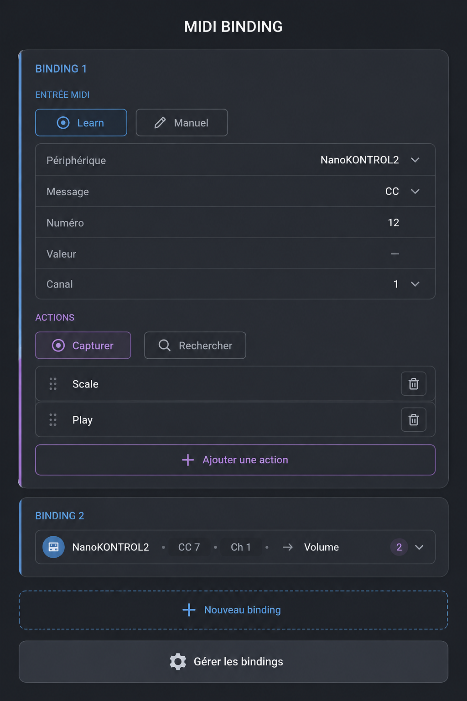

# MIDI Binding Panel Concept

## Verified implementation boundary — 2026-08-28

The current implementation reuses the Tool Gateway, Finder composition,
canonical `commitBatch` persistence, shared contextual panel components, and a
single normalized MIDI routing service. Learn and Manual produce the same input
contract; Capture listens only to successful Tool Gateway invocations; ordered
actions stop at the first error; continuous mapping, inversion, enable/disable,
remap, delete, and exact conflict detection are covered by executable tests.

Tauri desktop uses `midir` only for native ports and bytes. The SMF parser,
transport, bindings, and routing remain outside that adapter. `ui.play` and
`ui.stop` address a selected MIDI Atome through the existing media transport.
No internal synthesizer or parallel visible MIDI player is introduced.

Hardware input/output, iPhone behavior, and AUv3 host input/output remain
**To verify** and are not covered by browser or unit-test evidence.

## Purpose

Implement a **minimal, mobile-first MIDI Binding system for atome/eVe**
that connects MIDI input events to existing eVe tools, commands,
parameters, or action sequences.

The binding system must **not create a second command system**. It must
reuse the existing tools and command/action infrastructure.

The UI must remain extremely simple for normal use while still
supporting advanced MIDI configurations when needed.

------------------------------------------------------------------------

## Visual Reference



The image above is a **visual reference**, not a requirement to
reproduce every decorative detail. Preserve its hierarchy, compact
mobile layout, collapsible bindings, and separation between binding
creation and global binding management.

------------------------------------------------------------------------

# 1. Core Mental Model

A **MIDI Binding** is an independent object composed of:

``` text
MIDI INPUT
    ↓
ONE OR MORE ACTIONS
```

Example:

``` text
Binding 1

Input:
NanoKONTROL2
Control Change 12
Channel 1

Actions:
Scale
Play
Fullscreen
```

A binding does not share its MIDI input definition with another binding.

Every new binding owns: - its MIDI device/source; - message type; -
channel; - message number; - optional value/range; - one or more
actions.

------------------------------------------------------------------------

# 2. Main Panel

The primary UI is a list of independent **Binding cards**.

Each card can be expanded or collapsed.

An expanded binding exposes its complete configuration.

A collapsed binding displays only a compact one-line summary.

Example collapsed representation:

``` text
NanoKONTROL2 · CC 7 · Ch 1 → Volume
```

If several actions exist, the compact representation may indicate the
number of actions rather than attempting to display everything.

The collapse/expand affordance must remain consistent with the global
eVe hierarchy convention.

Do not add decorative controls with no explicit function.

------------------------------------------------------------------------

# 3. MIDI Input

Each binding contains a MIDI input section.

The input can be defined in two ways **without introducing separate
global modes**.

## Learn

`Learn` listens for the next relevant MIDI event.

When received, populate the binding automatically with: - MIDI device /
input port; - message type; - channel; - message/controller/program/note
number; - value when relevant.

The event is captured for configuration. It must not accidentally
execute unrelated binding behavior while learning.

## Manual

`Manual` allows the same information to be entered without having the
MIDI controller physically available.

The user must be able to define:

``` text
Device
Message
Number
Value
Channel
```

Message examples include: - Control Change; - Program Change; - Note; -
other MIDI message types already supported by the eVe MIDI engine.

Do not hard-code the design around only CC or Program Change.

------------------------------------------------------------------------

# 4. Multiple MIDI Devices

Bindings must include the MIDI input device/source.

This is mandatory because a user can have multiple MIDI controllers
connected simultaneously.

A binding therefore conceptually resolves an input using information
such as:

``` text
device + message type + channel + number/value
```

Do not assume a single global MIDI device.

Advanced wildcard behavior such as `Any Device` or `Any Channel` may be
supported if the existing MIDI engine already makes this appropriate,
but it must not clutter the default interface.

------------------------------------------------------------------------

# 5. Actions

A binding can contain **one or many actions**.

Actions must reference the existing eVe tool/command infrastructure.

Do not implement a limited MIDI-specific list such as only:

``` text
Play
Stop
Fullscreen
Mute
```

Those may be valid actions, but MIDI Binding must be capable of invoking
whatever compatible tools/commands already exist in eVe.

------------------------------------------------------------------------

# 6. Capturing an Action

The `Capture` button enters an action-listening state.

The user then performs a normal operation in eVe.

The binding system listens for the **actual command emitted by the
tool**.

Examples:

``` text
press Play
activate Fullscreen
change Scale
trigger an existing tool
invoke an existing action
```

Intermediate UI navigation must not become the binding.

For example: - opening a palette is not the action; - navigating a menu
is not the action; - the final tool/command invoked is the action.

Once captured, the command is added to the binding's action list.

------------------------------------------------------------------------

# 7. Searching for an Action

The user must not be forced to physically invoke an action.

`Search` opens/reuses the **existing eVe Search module** and allows a
tool or command to be selected directly.

This is important for: - actions that are difficult to reach in the
current context; - configuration without changing the current project
state; - actions known by name; - commands not currently visible.

## Architectural requirement

Search should become/remain a **transverse composable module**.

The MIDI Binding panel should be able to invoke Search internally
instead of implementing another search engine.

If the current UI architecture prevents a module such as Search from
being embedded/invoked from another module, improve the component
architecture rather than duplicating Search.

------------------------------------------------------------------------

# 8. Adding Multiple Actions

The button:

``` text
+ Add action
```

adds another action to the same MIDI binding.

Example:

``` text
PC 7
  → Fullscreen
  → Play
  → Select object
```

The user may add many actions.

Do not impose an arbitrary small limit.

Actions should remain individually: - visible; - removable; -
editable/reassignable when appropriate; - reorderable if execution order
matters.

------------------------------------------------------------------------

# 9. Continuous Parameters / Sliders

Continuous tools require different behavior from simple trigger
commands.

Example:

``` text
External MIDI CC → Scale slider
```

Workflow:

1.  Select/create the binding.
2.  Learn or manually define the MIDI CC.
3.  Choose `Capture`.
4.  Touch/manipulate the Scale slider.
5.  Capture the **logical Scale parameter**, not every intermediate UI
    movement.
6.  Create a continuous CC → Scale mapping.

The binding may expose only the necessary mapping options, such as: -
target minimum; - target maximum; - inversion when useful.

Do not record the slider gesture as automation merely because the slider
moved during binding creation.

------------------------------------------------------------------------

# 10. Automation Is a Separate System

MIDI Binding and Automation/Action Recording are different components.

## MIDI Binding

Maps:

``` text
MIDI event → command / parameter / existing action
```

## Automation / Action Recorder

Stores:

``` text
parameter/action evolution over time
```

Do not merge their recording engines.

An already-created automation or action sequence can later be triggered
through MIDI exactly like another existing action.

Conceptually:

``` text
MIDI Binding
    ↓
Play existing Action Clip
```

This preserves modularity.

------------------------------------------------------------------------

# 11. New Binding

`+ New binding` creates another independent binding card.

Example:

``` text
Binding 1
  input...
  actions...

Binding 2
  input...
  actions...

+ New binding
```

Each binding has its own MIDI input and its own actions.

------------------------------------------------------------------------

# 12. Collapsed Bindings

Bindings should be collapsible because the interface is primarily
mobile.

Expanded:

``` text
Binding 1

MIDI Input
Learn / Manual

Device
Message
Number
Value
Channel

Actions
Capture / Search

Scale
Play

+ Add action
```

Collapsed:

``` text
NanoKONTROL2 · CC 7 · Ch 1 → Volume
```

A subtle device icon may appear in the collapsed summary if useful for
visual recognition, but it is not required.

Avoid redundant icons.

------------------------------------------------------------------------


### Shared Chevron Component

The expand/collapse chevron used by MIDI Binding cards must **not introduce a new icon, shape, interaction, or visual treatment**.

It must reuse the **same shared chevron component already used by eVe/Atome lists and hierarchical panels**.

Requirements:
- same component implementation;
- same visual language;
- same open/closed states;
- same size and stroke/fill treatment;
- same interaction behavior;
- same placement convention;
- same right/left-handed adaptation rules when applicable.

The MIDI Binding panel must therefore look and behave like a standard Atome/eVe panel, not like a standalone custom interface.

Any future change to the shared chevron component must propagate consistently to:
- List mode;
- MIDI Binding;
- other hierarchical or collapsible panels using the same component.

Do not fork or duplicate the chevron implementation for MIDI Binding.


# 13. Manage Bindings

`Manage bindings` is intentionally separated from `New binding`.

It opens the advanced/global management view.

This is **not the normal binding-creation interface**.

The management view must allow the user to: - inspect all bindings; -
enable/disable a binding temporarily; - delete a binding; -
remap/reassign it; - edit its MIDI source; - edit its action(s); -
identify conflicts.

A table/matrix is acceptable in this secondary management screen if it
improves overview.

Do not expose that complexity in the primary mobile binding panel.

------------------------------------------------------------------------

# 14. Integration With eVe Visualization Modes

The binding system must respect the existing interaction rules of the
three eVe visualization modes.

## Natural Mode

Current behavior to preserve: - double-click an atom to enter editing; -
editing outline appears; - editing footer appears; - the footer includes
the existing resize/expand behavior and close control; - contextual
tools correspond to the active edited atom; - when several atoms are in
edit state, a simple click switches the active atom/context.

MIDI Binding should integrate into the existing contextual editing
workflow.

Do not redefine double-click behavior merely for MIDI.

## List Mode

List mode works differently.

The contextual bar is already available because the list itself is
treated as the current editing context.

It contains: - a persistent/common section, especially playback/media
controls; - a variable contextual section driven by the selected
row/item.

A simple click on a row updates the contextual portion.

MIDI Binding must use this existing context model.

Do not require an unnecessary double-click.

## Matrix Mode

Matrix follows the same general contextual model as List: - context is
already available; - selecting an item/cell updates the relevant
contextual controls.

MIDI Binding must integrate without introducing another interaction
model.

------------------------------------------------------------------------


# 14A. MIDI Binding Tool Placement

The **MIDI Binding tool belongs in the standard right-side contextual tool panel**, not in the Flower menu.

Reason:
- the Flower menu is already dense;
- MIDI Binding is context-sensitive and acts on the currently relevant Atome/eVe object;
- the contextual panel is already designed to expose tools for the active editing context;
- the contextual panel can scroll, so adding MIDI Binding there does not require another permanent top-level control.

The MIDI Binding entry must therefore use the existing contextual-tool system and the standard Atome/eVe panel look.

Behavior by visualization mode:

## Natural Mode

- MIDI Binding appears in the right contextual panel when an atom is in edit mode.
- The active edited atom is the default binding target.
- If several atoms are currently editable, a normal selection change updates the active target exactly as the contextual panel already does.
- Do not change the existing double-click/edit/close workflow.

## List Mode

- The right contextual panel already exists while working in List mode.
- MIDI Binding is available directly in that panel.
- The list is the initial context.
- Selecting a row/item updates the contextual target using the existing List selection behavior.
- No additional double-click is required.

## Matrix Mode

- Follow the same contextual principle as List mode.
- MIDI Binding is available in the existing contextual panel and follows the active selected item/cell/context.

Do not create a second MIDI-specific contextual system.


# 14B. Temporary MIDI Test Panel

Implement a **temporary development/test panel** for validating the MIDI engine independently from the binding workflow.

This panel is a diagnostic tool, not a replacement for the MIDI Binding UI.

It must use the **same normalized MIDI engine, ports, routing and event contracts** as the production MIDI system. Do not put platform-specific MIDI logic directly in the test UI.

## Receive / Monitor

Allow the developer/user to select or listen to available MIDI inputs and inspect incoming events.

At minimum display:
- source/device;
- channel;
- message type;
- number/note/controller/program where applicable;
- value/velocity where applicable.

The goal is to confirm that external MIDI reaches Atome correctly before debugging bindings.

## Send / Output

Allow selecting an available MIDI output and manually sending basic test messages.

At minimum support:
- Note On / Note Off;
- Control Change;
- Program Change.

Expose only the fields required by the selected message:
- output device;
- channel;
- note/controller/program number;
- velocity/value where applicable.

The panel must make it possible to verify both directions:

```text
External MIDI device → Atome/eVe
Atome/eVe → External MIDI device
```

Keep the panel deliberately simple. It is for diagnostics and implementation validation, not a full MIDI sequencer, router, or production control surface.


# 15. Target Semantics

The target of an action must come from the existing eVe command
semantics.

Do not create fragile bindings based purely on screen coordinates or UI
widgets.

The captured action should resolve the actual: - command/tool; - target
object when applicable; - parameters.

Bindings must survive normal UI rearrangement.

Where eVe already distinguishes fixed targets from contextual/current
selections, preserve that mechanism rather than inventing another one.

------------------------------------------------------------------------

# 16. Command Architecture

Preferred execution architecture:

``` text
MIDI Input
    ↓
MIDI Binding Resolver
    ↓
Existing eVe Command / Tool System
    ↓
Target / Parameter
```

MIDI code must not directly reimplement the behavior of tools.

For example, MIDI Play should invoke the same Play command used by the
UI.

This ensures: - identical behavior; - less duplicated code; - easier
undo/redo integration; - easier future tools; - searchable/capturable
commands; - consistent automation integration.

------------------------------------------------------------------------

# 17. Binding Data Model

The exact implementation may adapt to the existing framework, but
conceptually a binding needs information equivalent to:

``` text
Binding
  enabled

  midi_input
    device
    message_type
    channel
    number
    value/range

  actions[]
    command/tool
    target
    parameters
    execution metadata if required
```

Do not make the UI mirror this data structure mechanically.

The UI must remain much simpler than the internal representation.

------------------------------------------------------------------------

# 18. Conflict Handling

The system must detect obvious MIDI conflicts.

Example:

``` text
NanoKONTROL2
CC 12
Channel 1
```

already assigned to another binding.

Do not interrupt normal work unnecessarily.

Conflict information belongs primarily in: - the binding editor when a
conflict is created; - `Manage bindings` for global inspection.

Allow intentional duplication if the architecture supports it and the
user explicitly chooses it.

------------------------------------------------------------------------

# 19. UI Design Rules

The panel is **mobile first**.

Requirements: - dark/gray background consistent with eVe; - extremely
- reuse standard Atome/eVe panel components and interaction conventions whenever they already exist;
few labels; - clear separation between MIDI input and actions; -
restrained color only to distinguish functional zones/states; - large
enough touch targets; - no decorative controls; - no redundant
navigation; - no "Boeing cockpit" dashboard; - advanced configuration
hidden until required.

The user should understand the normal workflow without MIDI expertise.

Primary workflow:

``` text
New binding
→ Learn MIDI
→ Capture action
→ Done
```

Alternative workflow:

``` text
New binding
→ Manual MIDI input
→ Search action
→ Done
```

Multi-action workflow:

``` text
New binding
→ Learn MIDI
→ Capture/Search action
→ Add action
→ Capture/Search another action
→ Done
```

------------------------------------------------------------------------

# 20. Do Not Add

Do not introduce: - a global MIDI input shared by all bindings; -
separate automatic/manual application modes; - a second automation
recorder; - a second Search implementation; - arbitrary action
restrictions; - duplicate `New binding` controls; - unexplained back
arrows; - unexplained overflow menus; - decorative numbering/icons; -
redundant labels; - unnecessary dashboards.

Every visible control must have a clear purpose.

------------------------------------------------------------------------

# 21. Acceptance Criteria

The implementation is complete when all of the following work:

1.  Create multiple independent bindings.
2.  Collapse and expand each binding.
3.  Learn MIDI from a connected device.
4.  Configure MIDI manually without the device.
5.  Distinguish multiple MIDI input devices.
6.  Configure message type, channel, number and relevant value/range.
7.  Capture an existing eVe command/tool as an action.
8.  Search for an existing command/tool through the existing Search
    system.
9.  Add multiple actions to one binding.
10. Remove/edit actions independently.
11. Map a MIDI CC continuously to a slider/parameter.
12. Keep automation recording independent from MIDI Binding.
13. Trigger an existing automation/action clip through a binding when
    applicable.
14. Create additional bindings with `New binding`.
15. Open `Manage bindings`.
16. Enable/disable bindings without deleting them.
17. Remap/delete bindings.
18. Detect conflicts.
19. Preserve Natural/List/Matrix interaction semantics.
20. Keep the normal mobile workflow visually minimal.
21. Reuse existing eVe command/tool/search/action infrastructure instead
    of duplicating it.

------------------------------------------------------------------------


Additional acceptance criteria:

22. MIDI Binding is exposed through the standard right contextual panel rather than adding another Flower-menu entry.
23. Natural/List/Matrix use their existing contextual-selection semantics to determine the binding target.
24. A temporary MIDI Test Panel can receive/monitor MIDI input from external devices.
25. The same test panel can send Note, CC and Program Change messages to a selected MIDI output.
26. The test panel uses the production normalized MIDI engine/API rather than independent UI-side MIDI logic.


# 22. Implementation Priority

1.  Inspect the existing MIDI input and command/tool architecture.
2.  Define the binding data model using existing abstractions.
3.  Implement MIDI Learn.
4.  Implement manual MIDI input.
5.  Connect bindings to the existing command/tool execution system.
6.  Implement action Capture.
7.  Integrate existing Search.
8.  Support multiple actions per binding.
9.  Implement continuous CC → parameter mapping.
10. Implement collapse/expand.
11. Implement `New binding`.
12. Implement `Manage bindings`.
13. Add enable/disable/remap/delete/conflict handling.
14. Verify Natural/List/Matrix integration.
15. Integrate MIDI Binding into the standard right contextual panel.
16. Build the temporary MIDI Test Panel for MIDI receive/send diagnostics.
17. Add regression tests.

------------------------------------------------------------------------

## Final Principle

**MIDI Binding is not a new action system.**

It is a thin, modular routing layer:

``` text
MIDI → existing eVe capabilities
```

The interface should expose that power with the smallest possible number
of controls.
